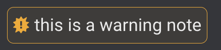

# ACCESS-Hive
[][website]
[][github-repo]
[][forum]

Documentation hub for the Earth System models, ACCESS, and their community.

This repository uses [Material for MkDocs](https://squidfunk.github.io/mkdocs-material/) to build the website which accessible at this URL: 
https://access-hive.org.au/

# How to Contribute
If you wish to add documentation to the ACCESS-Hive website see the [contribution guide](https://access-hive.org.au/about/contribute/) for instructions.

## Styling guidelines for contribution
Please follow the guidelines below so as to make the Hive consistent among the pages contributed by different people. 

- Always prefer HTML syntax to Markdown when possible;
- Titles/subtitles should NOT include: code lines/blocks, bold (titles are usually already bold), italic, links;
- Code lines/blocks need to be used for lines/blocks of code and terminal commands;
- Italic needs to be used when referring to specific proper nouns (for example *Gadi* or *Accessdev*);
- Bold can be used to highlight some words (please do not overuse it);
- Links should be coded using HTML syntax. External links (links that go to a website other than https://access-hive.org.au) need to specify `target="_blank"` (see HTML cheatsheet below);
- To signal an important note within the text, consider using a "warning note" (see HTML cheatsheet below);
- Instructions for different versions (for example different operative systems or different model vesrions) can be rendered using tabs (see HTML cheatsheet below);

### HTML Cheatsheet for the Hive
|Style|HTML Syntax|Rendered example|
|---|---|---|
|**Bold**|\<b>bold\</b>|**bold**|
|**Italic**|\<i>italic\</i>|*italic*|
|**Code line**|\<code>this is a code line\</code>|`this is a code line`|
|**Code block**|\<pre>\<code>this is a code block\</code>\</pre>|<pre><code>this is a code block</code></pre>|
|**Link (internal)**|\<a href="https://access-hive.org.au">ACCESS-Hive link\</a>|<a href="https://access-hive.org.au">ACCESS-Hive link</a>|
|**Link (external)**|\<a href="https://www.google.com" target="_blank">Google link\</a>|<a href="https://www.google.com" target="_blank">Google link</a>&#9099;|
|**Warning note**|\
this is a warning note\
||
|**Tabs**|\<pre>\<code>this is a code block\</code>\</pre>||

<!-- - Pull the latest version of `development` branch locally by using the following commands:

    > Fetch the remote branches from github:

    `git fetch`

    > On terminal, switch to the `development` branch locally using the command:

    `git switch development`     

    > Pull the latest changes from remote `development` branch locally: 

    `git pull`

- Once the latest version of `development` branch is pulled locally, use the following two commands to create the new branch and push it to github respectively:

    `git checkout -b dev/jasmeen/legacy-release`

    `git push --set-upstream origin dev/jasmeen/legacy-release`

- Prefixing the branch name with `dev/jasmeen` might be used as an indicator that this needs to merged in the `development` branch of access-hive (staging branch deployed on https://access-hive.org.au/development-website/), and _**not**_ the main branch.

- Work locally on the branch `dev/jasmeen/legacy-release`, and push the commits using the commands: 

    `git add .`

    `git commit -m "First commit"`

    `git push`
  
- While working locally on the branch, please make sure to regularly pull changes from remote `development` branch into your branch, using the command:

    `git pull origin development`

  This would make sure that the local branch `dev/jasmeen/legacy-release` is always in sync with the latest changes in the remote `development` branch. 

- Once the changes on the local branch `dev/jasmeen/legacy-release` is ready to be integrated with the `development` branch, create a pull request on github by changing the `base` to `development`. (Please find the below screenshot). This would create a pr on the `development` branch.

    

- When creating a pull request (PR) please also assign a reviewer to avoid delays. For technical content please assign an expert reviewer. -->

# License
The ACCESS-Hive site is covered by the [CC-BY 4.0 license](https://creativecommons.org/licenses/by/4.0/legalcode).

However, the material linked to from ACCESS-Hive is covered by various licensing agreements. Our users should directly refer to the terms and conditions of any material they are using to understand their rights and responsibilities.

[website]: https://access-hive.org.au
[github-repo]: https://github.com/ACCESS-Hive/access-hive.github.io.git
[forum]: https://forum.access-hive.org.au