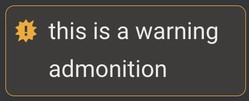
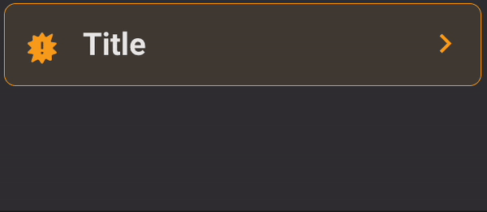
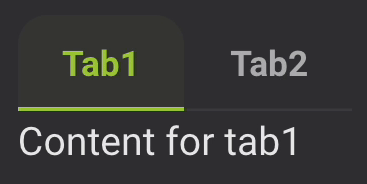

# ACCESS-Hive Docs
[][hive-docs-website]
[][github-repo]
[][forum]
[](https://github.com/ACCESS-NRI/access-hive.org.au/actions/workflows/link_check.yml)

This repository is the implementation of the ACCESS-Hive Docs website accessible at the following URL:<br>
https://access-hive.org.au/

The ACCESS-Hive Docs website hosts the documentation for ACCESS users: getting set up, running models and model evaluation.

# How to Contribute
If you wish to add documentation to the ACCESS-Hive Docs website check the [contribution guide](https://access-hive.org.au/about/contribute/) for instructions.

## Styling guidelines for developers
The ACCESS-Hive Docs website is built using [Material for MkDocs](https://squidfunk.github.io/mkdocs-material/). For detailed information on markdown syntax and different features, please refer to [mkdocs-material documentation](https://squidfunk.github.io/mkdocs-material/reference/).

Please follow the guidelines below to make the Hive Docs consistent among all the pages contributed by different people. 

- Always prefer Markdown syntax to HTML when possible;
- All internal URLs need to be ABSOLUTE links, starting with `/` which indicates the base website `https://access-hive.org.au/`. So, a reference to the page `https://access-hive.org.au/models/configurations/access-cm/` will be `/models/configurations/access-cm`. Also, all assets need to be linked starting with `/assets/...`. This because currently the link checker does not handle relative links properly.
- Titles/subtitles should NOT include: code lines/blocks, bold (titles are usually already bold), italic, links;
- Code lines/blocks need to be used for lines/blocks of code, terminal commands and file/directory paths/names;
- Italic needs to be used when referring to specific proper nouns (for example _Gadi_ or _payu_);
- Bold can be used to highlight some words (please do not overuse it);
- All types of admonitions (info, warning, etc.), collapsible and not, can be used as described in the [documentation](https://squidfunk.github.io/mkdocs-material/reference/admonitions/), but they are rendered slightly differently. For the HTML version of them, please refer to the [HTML/Markdown cheatsheet for the Hive Docs](#htmlmarkdown-cheatsheet-for-the-hive-docs).
- Instructions for different versions (for example different operative systems or different model versions) can be rendered using tabs (see [HTML/Markdown cheatsheet for the Hive Docs](#htmlmarkdown-cheatsheet-for-the-hive-docs));
- Terminal input/output examples can be rendered using [animated-terminal.js](https://github.com/atteggiani/animated-terminal.js)

### Styling Markdown using CSS
#### Attribute lists
To style Markdown using custom CSS, you can use [attribute lists](https://python-markdown.github.io/extensions/attr_list/) by adding the desired CSS style (in-line or adding classes as defined in the `access-nri.css` file) inside curly brackets (starting with a colon) right after the markdown syntax.

For example, to make an image 50%-wide and with rounded borders, you can write the following:
```
{: style="width: 50%; border-radius: 0.6rem;" }
```
#### Markdown in HTML
You can use [Markdown in HTML](https://squidfunk.github.io/mkdocs-material/setup/extensions/python-markdown/?h=md+in+html#markdown-in-html) by adding the `markdown` attribute inside an HTML tag.<br>
You can then style the HTML tag using CSS (in-line or adding selectors to the `access-nri.css` file).

For example, to render a markdown section with half font-size, you can write the following:
```
<div markdown style="font-size: 0.5em;">
### Section with half font-size (This will appear in the table of content)

- First _bullet_ point
- Second bullet **point**
</div>
```

### Custom HTML tags
Some custom HTML tags were created (in the `js/custom-tags.js` file) to facilitate the rendering of some components.<br>
The following custom tags are available:

- **"Not supported by ACCESS-NRI" admonition**<br>
  The `<custom-not-supported/>` tag renders a preset "Not supported by ACCESS-NRI" admonition.

- **References**<br>
  The `<custom-references> ... </custom-references>` tag renders references to be used at the bottom of a page. Each new line (created by pressing <kbd>return</kbd>/<kbd>Enter</kbd>) inside `...` is rendered as a separate bullet point. A hyphen (`-`) can included at the beginning of a new line (for clarity) but it is stripped off at the time of rendering.<br>
  For example, to reference 2 links you can write:
  ```
  <custom-references>
    - [First reference](first-reference-url)
    - [Second reference](second-reference-url)
  </custom-references>
  ```

- **Simulated terminal info**<br>
  The `<custom-simulated-terminal-info/>` tag renders a preset info admonition on the pages where simulated terminal are used.<br>
  It should not be used manually as it is automatically embedded in the pages containing simulated terminals.


### HTML/Markdown Cheatsheet for the Hive Docs
|Style|Markdown Syntax|HTML Syntax|Rendered example|
|---|---|---|---|
|**Bold**|\*\*bold**|\<b>bold\</b>|**bold**|
|**Italic**|\_italic_|\<i>italic\</i>|_italic_|
|**Code line**|\`code line`|\<code>code line\</code>|`code line`|
|**Code block**|\```<br>&emsp;code block<br>```|\<pre><br>&emsp;\<code>code block\</code><br>\</pre>|<pre><code>code block</code></pre>|
|**[Admonition](https://squidfunk.github.io/mkdocs-material/reference/admonitions/#usage) (not collapsible)**|!!! warning<br>&emsp;this is a warning admonition|\<div class="admonition warning"><br>&emsp;this is a warning<br>&emsp;admonition<br>\<div>||
|**Collapsible [Admonition](https://squidfunk.github.io/mkdocs-material/reference/admonitions/#usage)**|??? warning title<br>&emsp;this is a collapsible warning admonition|\<details class="warning"><br>&emsp;\<summary><br>&emsp;&emsp;\<p><br>&emsp;&emsp;&emsp;this is a collapsible<br>&emsp;&emsp;&emsp;warning admonition<br>&emsp;&emsp;\</p><br>&emsp;\</summary><br>\</details>||
|**Tabs**|N/A|\<div class="tabLabels" label="your-tab-label"><br>&emsp;\<button>Tab1\</button><br>&emsp;\<button>Tab2\</button><br>\</div><br>\<div class="tabContents" label="your-tab-label"><br>&emsp;\<div><br>&emsp;&emsp;Content for tab1<br>&emsp;\</div><br>&emsp;\<div><br>&emsp;&emsp;Content for tab2<br>&emsp;\</div><br>\</div>||


# License
The ACCESS-Hive Docs website is covered by the [CC-BY 4.0 license](https://creativecommons.org/licenses/by/4.0/legalcode).

However, the material linked to from ACCESS-Hive Docs is covered by various licensing agreements. Our users should directly refer to the terms and conditions of any material they are using to understand their rights and responsibilities.

[hive-docs-website]: https://access-hive.org.au
[github-repo]: https://github.com/ACCESS-NRI/access-hive.org.au
[forum]: https://forum.access-hive.org.au