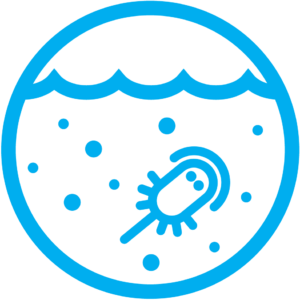

# Model Components

ACCESS components represent different chemical, physical or biological parts of the Earth System.

<table style="width:90%;margin-left:auto;margin-right:auto;">
  <tr>
     <td><a href="ocean" title="Ocean"></td></a>
     <td><a href="sea-ice" title="Sea Ice"></td></a>
     <td><a href="atmosphere" title="Atmosphere"></td></a>
   </tr> 
  <tr>
     <td style="text-align:center"><a href="ocean" title="Ocean">Ocean</td></a>
     <td style="text-align:center"><a href="sea-ice" title="Sea Ice">Sea-Ice</td></a>
     <td style="text-align:center"><a href="atmosphere" title="Atmosphere">Atmosphere</td></a>
   </tr> 
   <tr>
      <td><a href="land" title="Land"></td></a>
      <td><a href="bgc_land" title="Biogeochemistry-Land"></td></a>
      <td><a href="bgc_ocean" title="Biogeochemistry-Ocean"></td></a>
   </tr>
   <tr>
      <td style="text-align:center"><a href="land" title="Land">Land</td></a>
      <td style="text-align:center"><a href="bgc_land" title="Biogeochemistry-Land">Biogeochemistry Land</td></a>
      <td style="text-align:center"><a href="bgc_ocean" title="Biogeochemistry-Ocean">Biogeochemistry Ocean</td></a>
   </tr>
   <tr>
      <td><a href="aerosols_atmospheric_chemistry" title="Aerosols"></td></a>
      <td><a href="aerosols_atmospheric_chemistry" title="Atmospheric Chemistry"></td></a>
      <td><a href="coupler" title="Coupler"></td></a>
    </tr>
   <tr>
      <td style="text-align:center"><a href="aerosols_atmospheric_chemistry" title="Aerosols">Aerosols</td></a>
      <td style="text-align:center"><a href="aerosols_atmospheric_chemistry" title="Atmospheric Chemistry">Atmospheric Chemistry</td></a>
      <td style="text-align:center"><a href="coupler" title="Coupler">Coupler</td></a>
    </tr>
</table>

Most model components have originated from collaborations with international research groups. These include:

- [UK Met Office][met-office-web] (UM atmospheric model)
- [NOAA/ Geophysical Fluid Dynamics Laboratory (GFDL)][noaa-gfdl-web] (for the modular ocean model component MOM)
- [Los Alamos National Laboratory (LANL)][lanl-web] (for the CICE sea ice model component)
- [Centre Européen de Recherche et de Formation Avancée en Calcul Scientifique (CERFACS)][cerfacs-web] (for the atmosphere-ocean-ice OASIS3-MCT coupler)
- [United Kingdom Chemistry and Aerosols (UKCA)][ukca-web] (for the atmospheric composition components)
- [CSIRO][csiro-web] [CLEX][clex-web], [COSIMA][cosima-web] (for CABLE, CASA and WOMBAT models, which are developed in Australia)

[met-office-web]: https://www.metoffice.gov.uk/
[noaa-gfdl-web]: https://www.gfdl.noaa.gov/
[lanl-web]: https://www.lanl.gov/
[cerfacs-web]: https://cerfacs.fr/en/
[ukca-web]: https://www.ukca.ac.uk/
[csiro-web]: https://www.csiro.au/
[clex-web]: https://www.climateextremes.org.au/
[cosima-web]: http://www.cosima.org.au/
