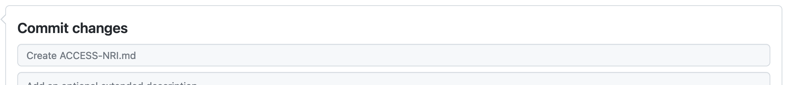

# Modify the documentation

There are two ways to modify the documentation:

 - direct edit on GitHub. This method is adequate for small modifications to a single file.
 - local edit on your local computer. This method is recommended for large modifications.

## Open an issue

For all additions or modifications to the ACCESS-Hub site, it is recommended to start by opening an [Issue](https://github.com/ACCESS-NRI-Community/ACCESS-Hub/issues) in the ACCESS-Hub GitHub repository. After creation, please [assign the Issue to yourself in the right-hand side panel](https://docs.github.com/en/issues/tracking-your-work-with-issues/assigning-issues-and-pull-requests-to-other-github-users) if you intend on working on the issue.

## Edit directly on GitHub

For a very simple change, the easiest is to go to the ACCESS-Hub site and navigate to the page you want to modify.

At the right of the title, you will see a pen icon :material-pencil:. When you click on this icon, your browser will open the file in GitHub allowing you to edit the file. Enter your modification in the main pane. Then add a commit message in the Commit changes box.
<figure markdown>
  
  <figcaption>Where to write your commit message</figcaption>
</figure>
???+ important
    You then need to choose to create a new branch and start a pull request. The `main` branch of the repository is protected and nobody can write to it directly.
    

When creating the pull request, make sure to add the text: `Closes #X` to the description, where X is the issue number related to this change. This will link the pull request and the issue together and the issue will be automatically closed once the pull request is accepted. This will also automatically build [a preview of the documentation with your proposed changes](#preview-of-the-documentation).

Then ask for a review using the Reviewer menu on the right-hand side panel.

You will be notified by email of any subsequent comment, request or action from the reviewer on this pull request. Please make sure you take any action required by the reviewer or your modification will not be accepted into the ACCESS-Hub site. 

## Edit locally on your computer

If you prefer to work locally on your computer (e.g. to preview the result of your modification locally before submitting it to the documentation), you will need to follow the usual series of steps when contributing to Open Source developments:

 - open an Issue
 - clone the repository locally 
 - start a branch to work on linked to the Issue
 - commit your modifications to that branch and push to GitHub
 - open a pull request between the `main` branch and your branch
 - ask for reviews and reply to requests for changes

If you don't know how to do these steps, please refer to the [Collaborating on GitHub section](submit_changes_to_github.md).

???+ tip
    If you have problems finding the page you need to edit, the easiest way is to head to the ACCESS-Hub site. If you click on the pen icon :material-pencil: at the top right of each page title, you will open a GitHub page showing you the path to the file you want to edit. 

### Previewing your changes locally

???+ note
    You can only preview your local changes if you have [installed mkdocs-material](contribution_setup.md/#install-material-for-mkdocs-not-required) on your computer.
    
    If you have installed mkdocs-material via conda, make sure you activate the correct environment first

MkDocs includes a live preview server, so you can preview your changes as you write your documentation. The server will automatically rebuild the site upon saving.

To start the server, open a terminal and navigate to your ACCESS-Hub local repository. Now type:
```
mkdocs serve
```
Your documentation will be built on  http://127.0.0.1:8000. Open this URL in your browser to see a preview of the documentation. The URL is given in the terminal when running the `mkdocs serve` command. Make sure you keep the command running so as to see live updates on saving your modifications.


## Preview of the documentation

When a pull request is opened or updated, GitHub will automatically build a preview of the documentation that includes the proposed changes. In the pull request, you will see the link to the preview appear in this fashion:


???+ info
    It can take a while for the preview to build.

    If you open the preview and it looks completely broken or if it hasn't updated from additional modifications in the pull request, it probably means the site hasn't finished building yet. If you wait a little bit and refresh the page, it should fix it.
