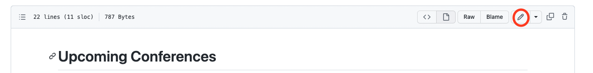

# Edit directly on GitHub

This way to edit the site allows people with no knowledge of Git to contribute to ACCESS-Hive but is only suitable for light modifications of existing pages.

Go to the page you want to modify on the ACCESS-Hive documentation site. At the right of the title, you will see a pen icon :material-pencil:. 
<figure markdown>
  
  <figcaption>Pen icon circled in red</figcaption>
</figure>

When you click on this icon, your browser will open the file in GitHub allowing you to edit the file. Enter your modification in the main pane. 

???+ note "Headers and table of content"
    
    The level 1 headers are reserved for the title of the page and are ignored from the pages' table of contents. Only use level 2 headers and higher to organise pages.

Then add a commit message in the Commit changes box.
<figure markdown>
  
  <figcaption>Where to write your commit message</figcaption>
</figure>
???+ important
    The `main` branch of the repository is protected and nobody can write to it directly. You will need to choose either to create a new branch (for ACCESS-Hive organisation members only) or to create a fork on your GitHub personal account (for non-members of ACCESS-Hive organisation) and then open a pull request in all cases.
    

When creating the pull request, make sure to follow the instructions given to you in the pull request template. The pull request will automatically build [a preview of the documentation with your proposed changes][preview].

Then ask for a review by tagging the `@ACCESS-Hive/reviewers` team in a comment. 

You will be notified by email of any subsequent comment, request or action from the reviewer on this pull request. Please make sure you take any action required by the reviewer or your modification will not be accepted into the ACCESS-Hive site. 

## Further edits

During the review process, you might be requested to edit your proposed changes. For this, you will need to navigate to the branch created by GitHub. At the top of the Pull request window on GitHub, you should see a link to your branch:
<figure markdown>
  
  <figcaption>Link to your branch circled in red</figcaption>
</figure>

Once you click on this link, navigate to and open the file you need to modify, then click on the pen icon in the toolbar on the right:
<figure markdown>
  
  <figcaption>Location of the edit "pen"</figcaption>
</figure>
Then commit your changes once again to the same branch. This will update the pull request and the preview of the site.

[preview]: local_edit.md#preview-from-a-pull-request