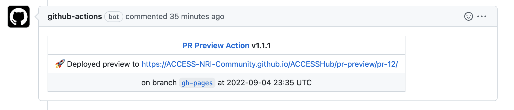

# Edit locally on your computer

If you want to submit a substantial contribution to ACCESS-Hive, it might be easier to do so from your own computer. Especially, it is a lot easier to proceed locally if you need to modify several files or want to modify the navigation of the site.

You can avoid creating your own fork for the repository by first becoming a member of ACCESS-Hive organisation. To become a member, please reply to [this issue][issue-179] and ask to be invited to join the organisation.

To work locally, you will need git and a text editor installed on your computer.

## Open an issue

For all additions or modifications to the ACCESS-Hive site, it is recommended to start by opening an [Issue][Issues] in the ACCESS-Hive GitHub repository. Consider [assigning the Issue to yourself in the right-hand side panel][Assign] if you intend on working on the issue and you are a member of the ACCESS-Hive organisation.

## Obtaining the source files

Everything is stored within the ACCESS-Hive repository on GitHub and you simply need to clone this repository to your local machine:

```bash
git clone git@github.com:ACCESS-Hive/access-hive.github.io.git
```

## Edit to ACCESS-Hive

Once you have installed all you need, you will need to follow the usual series of steps when contributing to Open Source developments:

- open an Issue
- clone the repository locally
- start a branch to work on, linked to the Issue
- commit your modifications to that branch and push to GitHub
- open a pull request between the `main` branch and your branch, follow the instructions from the Pull request template.
- ask for reviews by tagging the ACCESS-Hive/reviewers team and reply to requests for changes

If you don't know how to do these steps, please refer to our [Git and GitHub training][GitHowTo].

???+ tip "What page to edit"
    If you have problems finding the page you need to edit, the easiest way is to head to the ACCESS-Hive site. If you click on the pen icon :material-pencil: at the top right of each page title, you will open a GitHub page showing you the path to the file you want to edit.

???+ note "Headers and table of content"
    
    The level 1 headers are reserved for the title of the page and are ignored from the pages' table of contents. Only use level 2 headers and higher to organise pages.

## Preview of the documentation

### Preview from a Pull Request

When a pull request is created or updated, GitHub will automatically build a preview of the documentation that includes the proposed changes.

In the pull request, you will see the link to the preview appear in this fashion:



???+ info "Build delay"
    It can take a while for the preview to build, even after the CI check is indicated as finished. Please wait for the comment with the link to appear and allow for some time after that for the preview to be properly deployed.

    If you open the preview and it looks completely broken or if it hasn't updated from additional modifications in the pull request, it probably means the site hasn't finished building yet. If you wait a couple of minutes and refresh the page, it should fix itself.

### Local preview (if editing on your own computer)

MkDocs includes a live preview server, so you can preview your changes as you write your documentation. The server will automatically rebuild the site upon saving.

#### Software installation

To build the site locally, you need to install [Material for Mkdocs][MatforMkdocs] and other plugins. You can find a full list in the `requirements.txt` file in the root of the ACCESS-Hive repository. Please use `pip` for the installation as some of packages are not updated or not available on `conda`:

```bash
pip install -r requirements.txt
```

#### Start the server

To start the server, open a terminal and navigate to your ACCESS-Hive local repository. Now type:

```bash
mkdocs serve
```

Your documentation will be built on http://127.0.0.1:8000. Open this URL in your browser to see a preview of the documentation. The URL is given in the terminal when running the `mkdocs serve` command. Make sure you keep the command running so as to see live updates on saving your modifications.

[Issues]: https://github.com/ACCESS-Hive/website/issues
[Assign]: https://docs.github.com/en/issues/tracking-your-work-with-issues/
[GitHowTo]: https://access-nri.github.io/Training/HowTos/GitAndGitHub
[issue-179]: https://github.com/ACCESS-Hive/access-hive.github.io/issues/179
