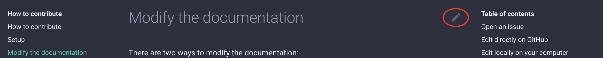

# How to contribute guide

???+ abstract
    The aim of this How to is to enable you to:

     - add or modify a link to a new documentation in an existing page
     - add a new page or tab with new documentation

This documentation is based on the [Material for Mkdocs](https://squidfunk.github.io/mkdocs-material/) theme. Please see the documentation for the theme or for [Mkdocs](https://www.mkdocs.org/) for a full explanation of all the capabilities.

The documentation is written in Markdown format. Please see this [cheat sheet](https://www.markdownguide.org/cheat-sheet/) for a quick reference to the base syntax. Please note that Material for Mkdocs extends that syntax.

## Setup

### Get the documentation source
You need to clone the ACCESS Hive Community repository to your local machine:
```
git clone git@github.com:ACCESS Hive/ACCESS Hive.git
```

### Install Material for Mkdocs (not required)

<!-- markdown-link-check-disable-next-line -->
If you would like to preview the documentation locally to check your modifications before submitting them to the ACCESS Hive site and you are comfortable with installing Python packages, you will need to install Material for Mkdocs. However, this is not required as there is [a preview available as part of the submission process][preview].

You can install Material for Mkdocs on your local machine with `pip` or `conda`:

 - using pip
 ```
 pip install mkdocs-material
 ```
 - using conda
 ```
 conda create -n doc -c conda-forge mkdocs-material
 ```
#### Additional plugins
The following plugins will also need to be installed if you want to preview the documentation locally, using the same method as for mkdocs-material:

 - mkdocs-git-revision-date-localized-plugin


## Modify the documentation

There are two ways to modify the documentation:

 - direct edit on GitHub. This method is adequate for small modifications to a single file.
 - local edit on your local computer. This method is recommended for large modifications.

### Open an issue

For all additions or modifications to the ACCESS Hive site, it is recommended to start by opening an [Issue][Issues] in the ACCESS Hive GitHub repository. After creation, please [assign the Issue to yourself in the right-hand side panel][Assign] if you intend on working on the issue.

### Edit directly on GitHub

For a very simple change, the easiest is to go to the page you want to modify on the ACCESS Hive documentation site. At the right of the title, you will see a pen icon :material-pencil:. 
<figure markdown>
  
  <figcaption>Pen icon circled in red</figcaption>
</figure>


When you click on this icon, your browser will open the file in GitHub allowing you to edit the file. Enter your modification in the main pane. Then add a commit message in the Commit changes box.
<figure markdown>
  
  <figcaption>Where to write your commit message</figcaption>
</figure>
???+ important
    You then need to choose to create a new branch and start a pull request. The `main` branch of the repository is protected and nobody can write to it directly.
    

When creating the pull request, make sure to add the text: `Closes #X` to the description, where X is the issue number related to this change. This will link the pull request and the issue together and the issue will be automatically closed once the pull request is accepted. This will also automatically build [a preview of the documentation with your proposed changes][preview].

Then ask for a review using the Reviewer menu on the right-hand side panel.

You will be notified by email of any subsequent comment, request or action from the reviewer on this pull request. Please make sure you take any action required by the reviewer or your modification will not be accepted into the ACCESS Hive site. 

???+ note
    
    The level 1 headers are reserved for the title of the page and are ignored from the pages' table of contents. Only use level 2 headers and higher to organise pages.

### Edit locally on your computer

If you prefer to work locally on your computer (e.g. to preview the result of your modification locally before submitting it to the documentation), you will need to follow the usual series of steps when contributing to Open Source developments:

 - open an Issue
 - clone the repository locally 
 - start a branch to work on linked to the Issue
 - commit your modifications to that branch and push to GitHub
 - open a pull request between the `main` branch and your branch
 - ask for reviews and reply to requests for changes

If you don't know how to do these steps, please refer to our [Git and GitHub training][GitHowTo].

???+ tip
    If you have problems finding the page you need to edit, the easiest way is to head to the ACCESS Hive site. If you click on the pen icon :material-pencil: at the top right of each page title, you will open a GitHub page showing you the path to the file you want to edit. 

???+ note
    
    The level 1 headers are reserved for the title of the page and are ignored from the pages' table of contents. Only use level 2 headers and higher to organise pages.

#### Previewing your changes locally

<!-- markdown-link-check-disable -->
???+ note
    You can only preview your local changes if you have [installed mkdocs-material][install] on your computer.
    
    If you have installed mkdocs-material via conda, make sure you activate the correct environment first
<!-- markdown-link-check-enable-->

MkDocs includes a live preview server, so you can preview your changes as you write your documentation. The server will automatically rebuild the site upon saving.

To start the server, open a terminal and navigate to your ACCESS Hive local repository. Now type:
```
mkdocs serve -f mkdocs-community.yml
```
Your documentation will be built on http://127.0.0.1:8000. Open this URL in your browser to see a preview of the documentation. The URL is given in the terminal when running the `mkdocs serve` command. Make sure you keep the command running so as to see live updates on saving your modifications.

### Preview of the documentation

When a pull request is opened or updated, GitHub will automatically build a preview of the documentation that includes the proposed changes. This can be used instead of local updates by setting your pull request as a draft for example.

In the pull request, you will see the link to the preview appear in this fashion:


???+ info
    It can take a while for the preview to build.

    If you open the preview and it looks completely broken or if it hasn't updated from additional modifications in the pull request, it probably means the site hasn't finished building yet. If you wait a little bit and refresh the page, it should fix it.

## Change the navigation

### Structure of the repository

The important elements of the repository to know about before modifying the navigation are:

 - `docs/` folder: this folder contains all the documentation pages. There is an `index.md` file for the Welcome page, one folder per tab on the site and an `assets/` folder to store images used in the documentation.
 - [`mkdocs-community.yml`][mkdocsYML]: it is a YAML formatted file, hence the `.yml` extension. The site navigation is defined in this file as well as options for the styling of the site. 

???+ info
    YAML is a popular choice for configuration files, as it is a simple way of encoding data structures in a text file. See this [short tutorial][YAMLtutorial].

### A simple example

The easiest way to explain how the navigation is defined is to look at an example. Let's say `mkdocs.yml` contains:

```yaml
nav:
  - Welcome: index.md
  - ACCESS-NRI: ACCESS-NRI/ACCESS-NRI.md
  - Community: 
    - Generate Bathymetry: community/bathymetry.md
  - How to contribute: 
    - How to contribute: help/how_to_contribute.md
    - Setup: help/contribution_setup.md
    - Modify the documentation: help/modify_documentation.md
    - Change the navigation: help/change_navigation.md
```

The top level category names define the tabs in the header bar. So here we have the tabs: "Welcome", "ACCESS-NRI", "Community" and "How to contribute". It also defines the name of the top section under each tab.


The second level of categories indicate the name of each page under that section. So the "ACCESS-NRI" tab has the text directly under the section "ACCESS-NRI". The "Community" tab has a section called "Community" that contains one page: "Generate Bathymetry". Finally, the "How to contribute" tab has 1 section "How to contribute" with 4 pages.

The filenames indicate the path to the file relative to the `docs/` folder containing the text for each page. It is recommended to use the title of each file (i.e. the Header 1) as the name of the page and the filename.


### Add sections to a tab

It is possible to define several sections per tab by using more levels of indentation. For example, to add a "My example" section to the "How to contribute" tab:

```yaml
nav:
  - Welcome: index.md
  - ACCESS-NRI: ACCESS-NRI/ACCESS-NRI.md
  - Community: 
    - Generate Bathymetry: community/bathymetry.md
  - How to contribute: 
    - How to contribute: help/how_to_contribute.md
    - Setup: help/contribution_setup.md
    - Modify the documentation: help/modify_documentation.md
    - Change the navigation: help/change_navigation.md
    - My example:
        - Beautiful example: help/beautiful_example.md
```
will create this navigation:


[mkdocsYML]: https://github.com/ACCESS Hive/ACCESS Hive/blob/main/mkdocs-community.yml
[YAMLtutorial]: https://kopi.dev/yaml-tutorial-beginner/
[preview]: ../modify_documentation/#preview-of-the-documentation
[GitHowTo]: https://access-nri.github.io/Training/HowTos/GitAndGitHub
[Issues]: https://github.com/ACCESS Hive/ACCESS Hive/issues
[Assign]: https://docs.github.com/en/issues/tracking-your-work-with-issues/assigning-issues-and-pull-requests-to-other-github-users
[preview]: #preview-of-the-documentation
[install]: ../contribution_setup/#install-material-for-mkdocs-not-required