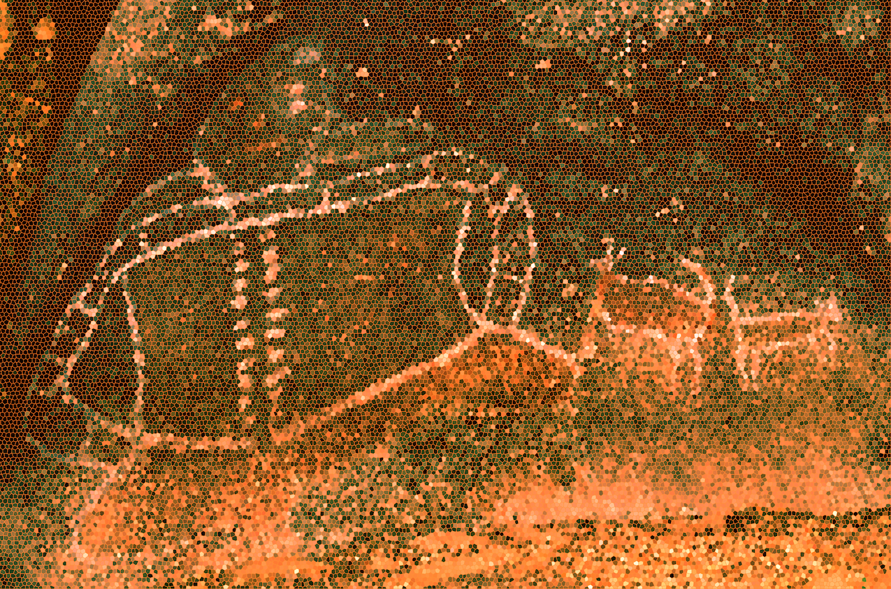

<!-- {align=right width=40%} -->
# 
 Welcome to ACCESS-Hive 

<!-- [][github-repo] -->
<!-- [][forum] -->

<table>
    <tr>
        <td width="70%">
             ACCESS-Hive is a portal to all documentation relevant to the Australian Community Climate and Earth System Simulator, ACCESS, and the wider ACCESS community. ACCESS-Hive is developed for and by the ACCESS community following an open-source development model.
              
        </td>
        <td>
            
        </td>
    </tr>
</table>

## Navigating ACCESS-Hive

    

        <a href="models/">
            

                

                    <b>
                        

                            
                                Models
                            
                        

                    </b>
                     
                    ACCESS is a family of related computer <b>models</b> or <b>components</b> that represent different parts of the Earth-System. ACCESS links various <b>model components</b> through software called <b>couplers</b> to form different <b>model configurations</b>. 
                
 
                

                    </img> 
                

            

        </a>
    

    

        <a href="models/running-a-model">
            

                

                    <b>

                        Run a Model
                    
</b> 
                    A step-by-step guides for running different <b>model configurations</b>.  
                

                

                    </img> 
                

            

        </a>
    

    

        <a href="model_evaluation/">
            

                

                    <b>

                        Model Evaluation
                    
</b> 
                    The ACCESS-NRI Model Evaluation (MED) section provides guidance for model evaluation of the ACCESS suite. We will promote a systematic approach to model evaluation, using curated data sets and robust statistical practices. 
                

                

                    </img> 
                

            

        </a>
    

    

        <a href="community_resources/">
            

                

                    <b>

                        Community Resources
                    
</b> 
                    Other important resources contributed by and for the ACCESS community such as further information about <b>community working groups</b>, <b>glossaries</b>, <b>training</b> and <b>model catalogs</b>. 
                

                

                    </img> 
                

            

        </a>
    

    

        <a href="https://forum.access-hive.org.au/" target="_blank">
            

                

                    <b>

                        Community Forum
                    
</b> 
                    <b>ACCESS-Hive Community Forum</b> is a platform where members of the ACCESS community come together to share their ideas, opinions, have fruitful discussions and plan shared activities. 
                

                

                    </img> 
                

            

        </a>
    

## About


## Support

There is a system of tags to identify who supports the linked documentation or software, and the level of support you can expect:

- `Supported by ACCESS-NRI` {{ supported }}

- `Recommended by ACCESS-NRI` {{ recommended }}

- `Community contributed` {{ community }}

See the [support page](about/support.md) for details about the support levels: what is supported, by who, and how to access help.

## Contribute to ACCESS-Hive[^1]

    <a href="contribute/" target="_blank">
        

            

                </img> 
            

            

                <b>

                    Contribute
                
</b> 
                ACCESS-Hive is a community-supported site, as such contributions to the ACCESS-Hive site are <b>encouraged by any member of the community</b>. Any member of the ACCESS community is most welcome to become code reviewers.
            

        

    </a>

[^1]:
    <a href="https://www.freepik.com/free-vector/team-crisis-managers-solving-businessman-problems-employees-with-lightbulb-unraveling-tangle-vector-illustration-teamwork-solution-management-concept_10613678.htm#query=teamwork%20cartoon&position=18&from_view=keyword&track=ais">Image by pch.vector</a> on Freepik

<!-- [How to Contribute][HCG]{ .md-button .md-button--primary }

ACCESS-Hive is a community supported site, as such contributions to the ACCESS-Hive site are **encouraged by any member of the community**. Member of the ACCESS community are also welcome to become reviewers. Please refer to the [contribution guidelines][HCG] to learn how you can help the ACCESS community build a documentation database useful to everyone. -->

## Acknowledgement of Country

</img>

We at ACCESS-NRI acknowledge the Traditional Owners of the land on which our research infrastructure and community operate across Australia and pay our respects to Elders past and present. We recognise the thousands of years of accumulated knowledge and deep connection they have with all the Earth systems we simulate.[^2]

[^2]:
    Photo by <a href="https://unsplash.com/@riegal?utm_source=unsplash&utm_medium=referral&utm_content=creditCopyText">René Riegal</a> on <a href="https://unsplash.com/photos/3ZQpQvZxb70?utm_source=unsplash&utm_medium=referral&utm_content=creditCopyText">Unsplash</a>
  
## License

![CC-BY][CC-BY]{ align=left }
The ACCESS-Hive site is covered by the [CC-BY 4.0 license][human-license].

ACCESS-Hive contains links to other material which is covered by various licensing agreements. Users should directly refer to the terms and conditions of any material they are using to understand their rights and responsibilities. 

[HCG]: contribute/index.md
[CC-BY]: https://i.creativecommons.org/l/by/4.0/88x31.png
[human-license]: about/License.md
[access-nri]: https://access-nri.org.au
[resources]: resources/data.md
[github-repo]: https://github.com/ACCESS-Hive/access-hive.github.io.git
[forum]: https://forum.access-hive.org.au
[hamburger button]: https://en.wikipedia.org/wiki/Hamburger_button
