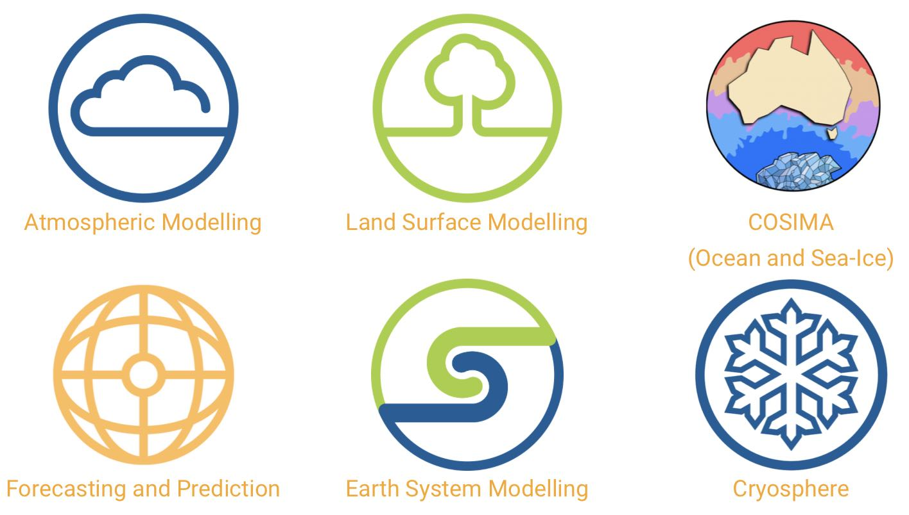

---
hide:
  - navigation
  - toc
---

<h1 class="homepage"></h1>

    

        
Welcome to ACCESS-Hive!

        
The open portal for the ACCESS user community, hosted by <a href="https://www.access-nri.org.au/" target="_blank">ACCESS-NRI</a>

    

    

        
    

    <a href="getting_started/" class="vertical-card">
        
New to ACCESS-Hive?

        
Get Started

    </a>
    <a href="about/user_support/" class="vertical-card">
        
Need help?

        
FAQ / Support

    </a>
    <a href="about/how_to_contribute" class="vertical-card">
        
Want to collaborate?

        
Contribute

    </a>

    <a href="models" class="vertical-card aspect-ratio1to1">
        

            
        

        
Models

    </a>
    <a href="models/run-a-model" class="vertical-card aspect-ratio1to1">
        

            
        

        
Run a Model

    </a>
    <a href="model_evaluation" class="vertical-card aspect-ratio1to1">
        

            
        

        
Data and Model Evaluation

    </a>
    <a href="community_resources" class="vertical-card aspect-ratio1to1">
        

            
        

        
Community Resources

    </a>

## Acknowledgement of Country

We at ACCESS-NRI acknowledge the Traditional Owners of the land on which our research infrastructure and community operate across Australia and pay our respects to Elders past and present. We recognise the thousands of years of accumulated knowledge and deep connection they have with all the Earth systems we simulate.

