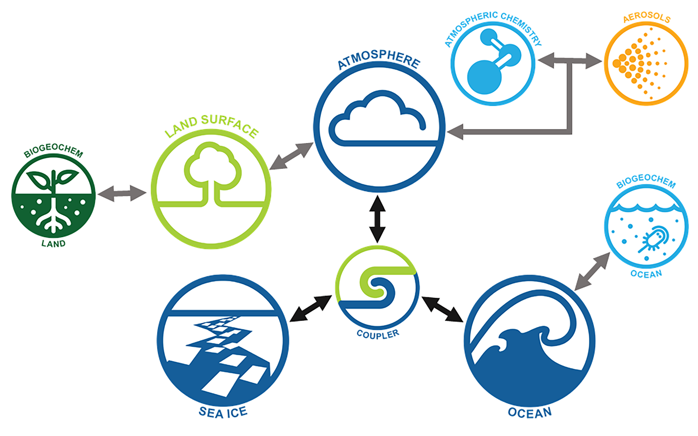
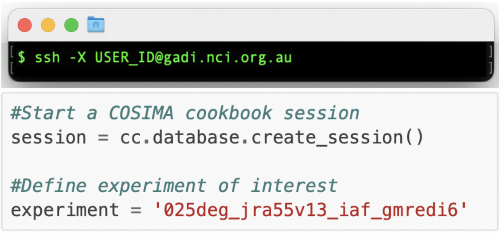
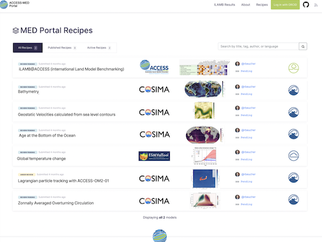
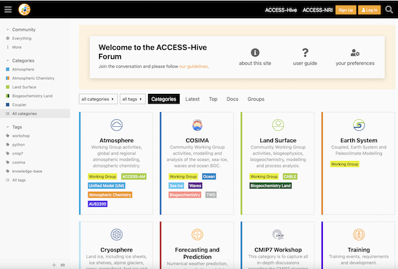

<!-- {align=right width=40%} -->
# 
 Welcome to ACCESS-Hive 

<!-- [][github-repo] -->
<!-- [][forum] -->

<table>
<tr>
<td width="70%">
 ACCESS-Hive is a portal to all documentation relevant to the Australian Community Climate and Earth System Simulator, ACCESS, and the wider ACCESS community. ACCESS-Hive is developed for and by the ACCESS community following an open-source development model.
  
</td>
<td>
    
</td>
</tr>
</table>

## Navigating ACCESS-Hive

<table>
<tr>
<td width="60%">
    
<a href="https://access-hive.org.au/model_components/"></img></a>
 
 ... will help you to get an overview of what ACCESS is all about and how our working groups contribute to models for climate and earth system simulations.
  
</td>
<td>
    
</td>
</tr>
<tr>
<td width="60%">
 
    
<a href="https://access-hive.org.au/training"></img></a>
 
 ... will provide step-by-step guides to get access to our models and data and start running your own ones with the help of our tutortials.
  
</td>
<td>
    
</td>
</tr>
<tr>
<td width="60%">
 
    
<a href="https://access-hive.org.au/resources/data/"></img></a>
 
 ... will provide you external links for more details on the useful content that is not currated by ACCESS.
  
</td>
<td>
    
</td>
</tr>
<tr>
<td width="60%">
 
    
<a href="https://forum.access-hive.org.au"></img></a>
 
 ... will take to our ACCESS-HIVE Community Forum, where you can get in direct exchange with members of our community.
  
</td>
<td>
    
</td>
</tr><td></td><td></td>
<tr>
</tr>
</table>

## About

## Support

There is a system of tags to identify who supports the linked documentation or software, and the level of support you can expect:

- `Supported by ACCESS-NRI` {{ supported }}

- `Recommended by ACCESS-NRI` {{ recommended }}

- `Community contributed` {{ community }}

See the [support page](about/support.md) for details about the support levels: what is supported, by who, and how to access help.

## Contributions

[How to Contribute][HCG]{ .md-button .md-button--primary }

ACCESS-Hive is a community supported site, as such contributions to the ACCESS-Hive site are **encouraged by any member of the community**. Member of the ACCESS community are also welcome to become reviewers. Please refer to the [contribution guidelines][HCG] to learn how you can help the ACCESS community build a documentation database useful to everyone.

## Acknowledgement

We at ACCESS-NRI acknowledge the Traditional Owners of the land on which our research infrastructure and community operate across Australia and pay our respects to Elders past and present. We recognise the thousands of years of accumulated knowledge and deep connection they have with all the Earth systems we simulate.

## License

![CC-BY][CC-BY]{ align=left }
The ACCESS-Hive site is covered by the [CC-BY 4.0 license][human-license].

ACCESS-Hive contains links to other material which is covered by various licensing agreements. Users should directly refer to the terms and conditions of any material they are using to understand their rights and responsibilities. 

[HCG]: contribute/index.md
[CC-BY]: https://i.creativecommons.org/l/by/4.0/88x31.png
[human-license]: about/License.md
[access-nri]: https://access-nri.org.au
[resources]: resources/data.md
[github-repo]: https://github.com/ACCESS-Hive/access-hive.github.io.git
[forum]: https://forum.access-hive.org.au
[hamburger button]: https://en.wikipedia.org/wiki/Hamburger_button
