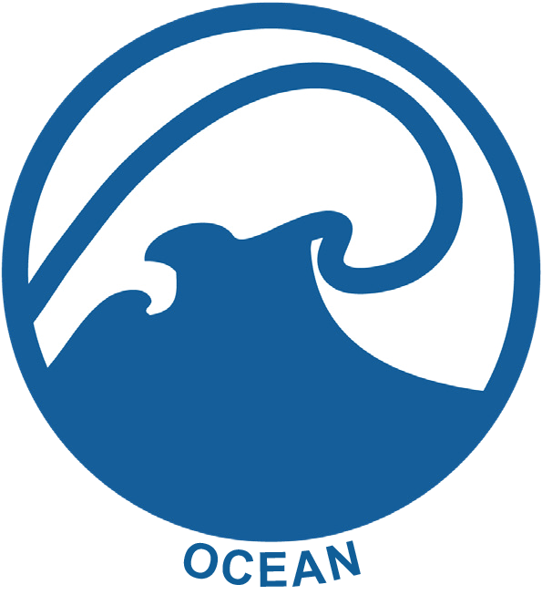

# Ocean Model Component



{align=right width=40%}

## [The Modular Ocean Model (MOM)][mom-wiki]  {{ supported }}
The Modular Ocean Model (MOM) is one of the ocean components of the ACCESS climate model system. MOM is a tool for studying the global ocean climate system, as well as capabilities for regional and coastal applications. 

### MOM5 {{ supported }}
[**Source Code**][mom5-github]

The current version of MOM used within ACCESS is MOM5.

### MOM6 {{ recommended }}

[**Source Code**][mom6-github] |
[**Tutorials**][mom6-tutes]

The next version, MOM6, is an open source component developed [by a consortium of scientists][gfdl-web] across several government agencies and academic institutions with critical contributions provided by researchers worldwide.

[mom5-github]: https://github.com/mom-ocean/MOM5
[mom6-github]: https://github.com/mom-ocean/MOM6
[mom6-tutes]: https://github.com/NOAA-GFDL/MOM6-examples/wiki/Tutorials
[mom-wiki]: https://mom-ocean.github.io/
[gfdl-web]: https://www.gfdl.noaa.gov/mom-ocean-model/

