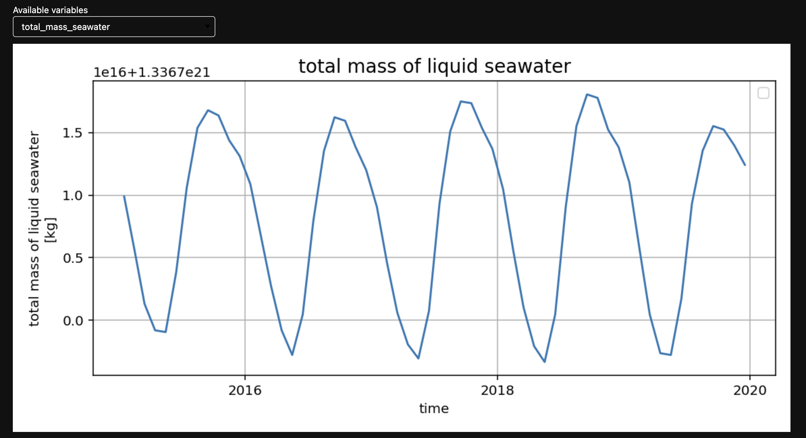

# Model Evaluation on Gadi

Model evaluation is about measuring how fit for purpose a particular model is. Model evaluation in climate science is the process of assessing the performance and reliability of computational models that simulate the Earth's climate system. It involves comparing model predictions to observed data to determine the model's accuracy and usefulness. In doing so, we can understand how well a model represents real-world climate processes and make predictions about future climate trends. Such rigorous model evaluation allows scientists to identify model strengths, weaknesses and uncertainties, as well as refine models to enhance their predictive capabilities. 

## What is Model Evaluation and Diagnostics?

Model Evaluation and Diagnostics (often shortened to "MED" at ACCESS-NRI) of ACCESS models includes:

- **Evaluation** 
    Model evaluation involves scrutinising a model's performance by comparing its output with observations. It also includes experiment comparisons, model testing with different scenarios and inter-model comparisons such as those used to prepare for Coupled Model Intercomparison Project (CMIP) submissions. For further explanations on experiments, see [here](/about/user_support/#frequently-asked-questions-faq).

- **Diagnostics** 
    Model diagnostics is the constant monitoring of model runs to detect any anomalies or inconsistencies. 

While evaluation and diagnostics can be described separately they often overlap and can use similar tools. ACCESS-NRI currently provides support for the following model evaluation and diagnostics frameworks on <i>Gadi</i>:

    <a href="/model_evaluation/evaluation_on_gadi/esmvaltool_workflow" class="vertical-card aspect-ratio2to1">
        

            </img>
        

        <!--
ESMValTool
 -->
    </a>
    <a href="/model_evaluation/evaluation_on_gadi/ilamb_workflow" class="vertical-card aspect-ratio2to1">
        

            </img>
        

        <!-- 
ILAMB
 -->
    </a>
    <a href="/model_evaluation/evaluation_on_gadi/cosima" class="vertical-card aspect-ratio2to1">
        

            </img>
        

        
COSIMA cookbook

    </a>
    <a href="/model_evaluation/evaluation_on_gadi/model_live_diagnostics" class="vertical-card aspect-ratio2to1">
        

            </img>
        

        
Model Live Diagnostics

    </a>
    <a href="/model_evaluation/evaluation_on_gadi/metplus" class="vertical-card aspect-ratio2to1">
        

            </img>
        

        <!-- 
METplus
 -->
    </a>
    <a href="/getting_started/environments" class="vertical-card aspect-ratio2to1">
        

            </img>
        

        
conda/analysis3 Environment

    </a>

