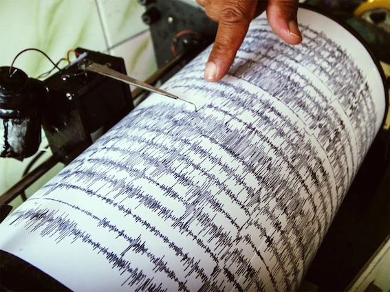
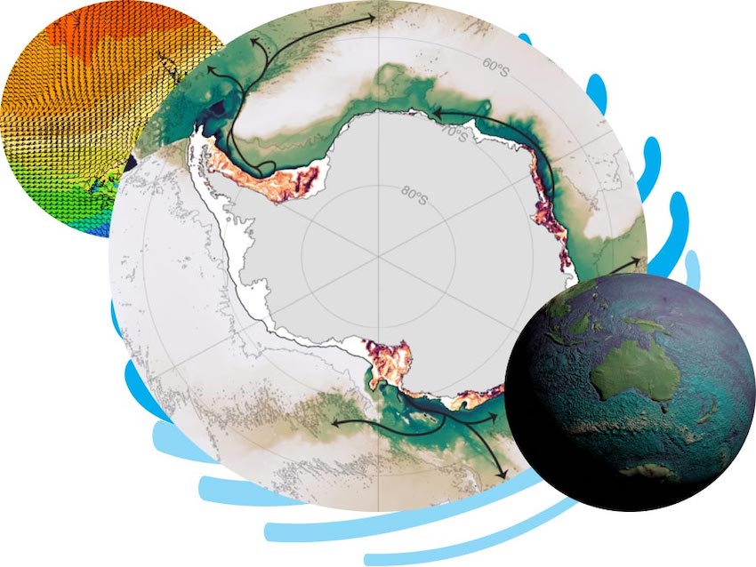
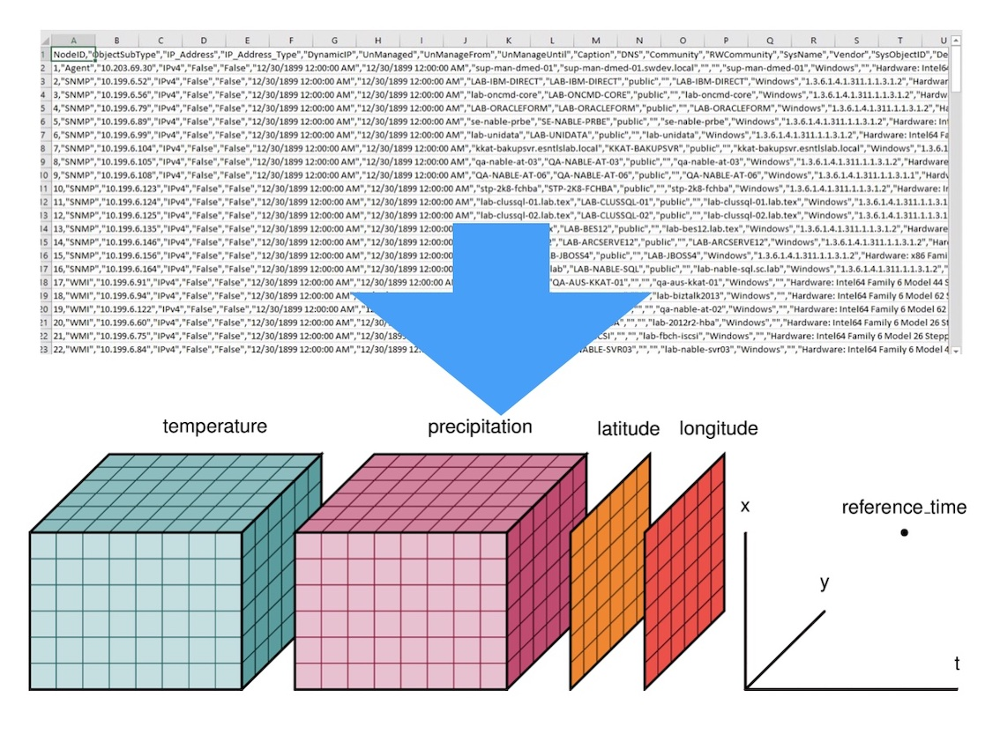
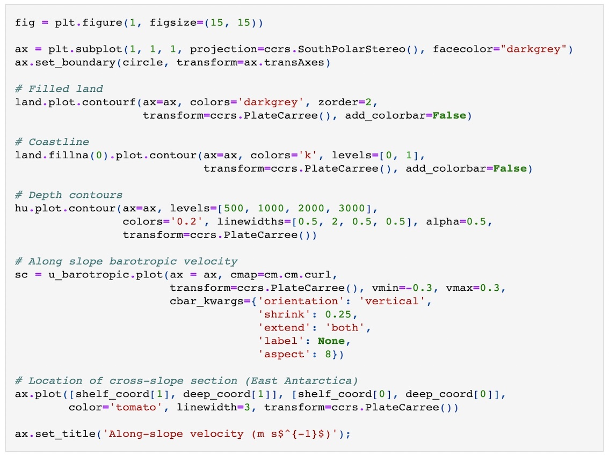

# Model Evaluation and Diagnostics (MED)

Model evaluation is about measuring how fit for purpose a particular model is.

If you are new to model evaluation and diagnostics, we recommend you read our [Getting Started with MED page](./model_evaluation_getting_started/index.md).

Here, we provide catalogs and pointers to [observational data](./model_evaluation_observational_catalogs.md) as well as [model data](./model_evaluation_model_catalogs/index.md) that can be used for evaluation. We provide [tools to process such data](./model_evaluation_data_processing.md) into a comparable format and a [gallery of recipes to evaluate](https://medportal.herokuapp.com/models/published) the formatted data.

<table class="center">
<tr>
<td width="24%">
    
<a href="./model_evaluation_observational_catalogs.md">Observational Data Catalog</img></a>
</td>
<td width="24%">
    
<a href="./model_evaluation_model_catalogs/index.md">Model Data Catalog</img></a>
</td>
<td width="24%">
    
<a href="./model_evaluation_data_processing.md">Data Format Processing</img></a>
</td>
<td width="24%">
    
<a href="./model_evaluation_recipe_gallery.md">Evaluation Recipe Gallery</img></a>
</td>
</tr>
</table>

Our vision: PLACEHOLDER FOR OUTCOME OF STAFF RETREAT