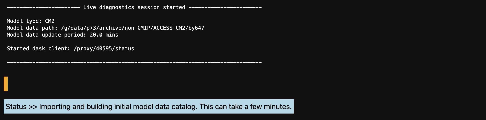
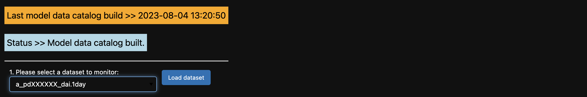
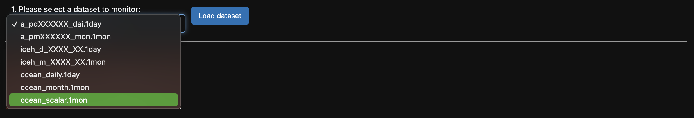
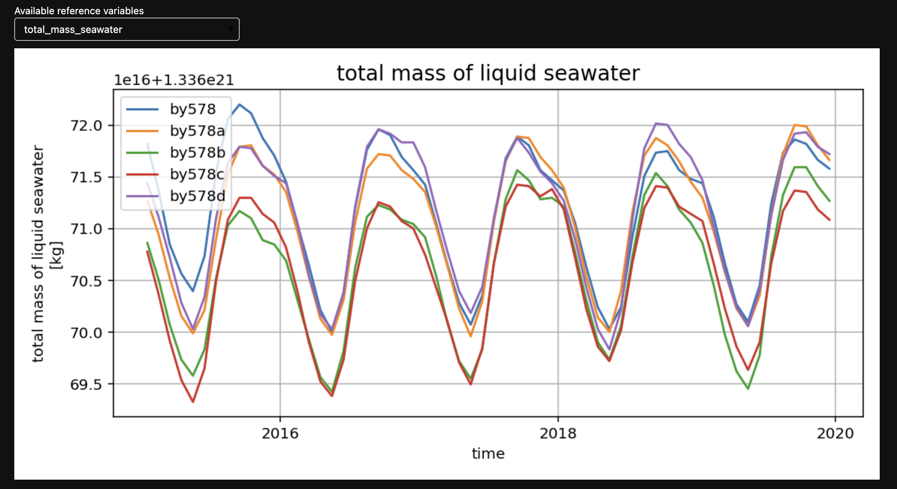

# ACCESS-NRI Model Live Diagnostics

## What is Model Live Diagnostics?

The Model Live Diagnostics framework is a simple, easy to use and accessible Jupter-based framework for the ACCESS modelling community to check, monitor, visualise and evaluate model behaviour and progress on currently running or ‘live’ ACCESS models on the Australian NCI supercomputer Gadi.

In addition to monitoring a live model, the package provides the functionality to load, visualise and compare legacy ACCESS model data with the selected live user model.

For detailed information, tutorials and more, please go to the
<div class="card-container">
    <a href="https://med-live-diagnostics.readthedocs.io/en/latest/index.html" class="vertical-card aspect-ratio2to1" target="_blank">
        <div class="vertical-card-image-container">
            </img>
        </div>
        <div class="vertical-card-text-container bold ">Model Diagnostics Documentation</div>
    </a>
</div>

## Showcase: Monitoring total seawater mass of an ACCESS CM2 run

In our showcase, we will monitor the progress of an [ACCESS Coupled Model 2 (CM2)](../../models/run-a-model/run-access-cm.md) run.

We first start a session (for details on the paths and package see the <a href="https://med-live-diagnostics.readthedocs.io/en/latest/index.html" target="_blank">documentation</a>):

```
import med_diagnostics
session = med_diagnostics.session.CreateModelDiagnosticsSession(model_type='CM2', model_path='path/to/your/live/model/data/output', period=5)
```

Once a session is started, you will see the following sesion summary and blue status message while the new intake catalogue is being built from the live model data. Depending on the size of the model data, this can take a number of minutes.

<div style="text-align: center;">
    
</div>

Once the live model data catalogue has been successfully built, the blue status message will update and the orange status message will report the time and date of the last live model catalogue build.

<div style="text-align: center;">
    
</div>

All available datasets from the selected model will be listed in the dropdown. Select the dataset you wish to monitor and click ‘Load dataset’.

<div style="text-align: center;">
    
</div>

Once loaded, a plot displaying the first data variable in the list will appear. Use the dropdown list to select and plot any available model variables.

<div style="text-align: center;">
    
</div>

With a few more clicks, you can also load legacy data to compare with, for example other CM2 models like by578 or by578a:

<div style="text-align: center;">
    
</div>
