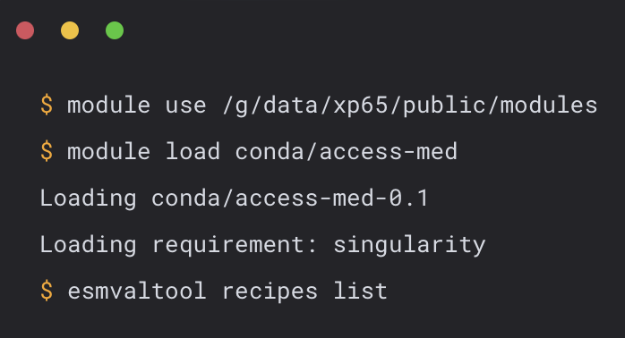
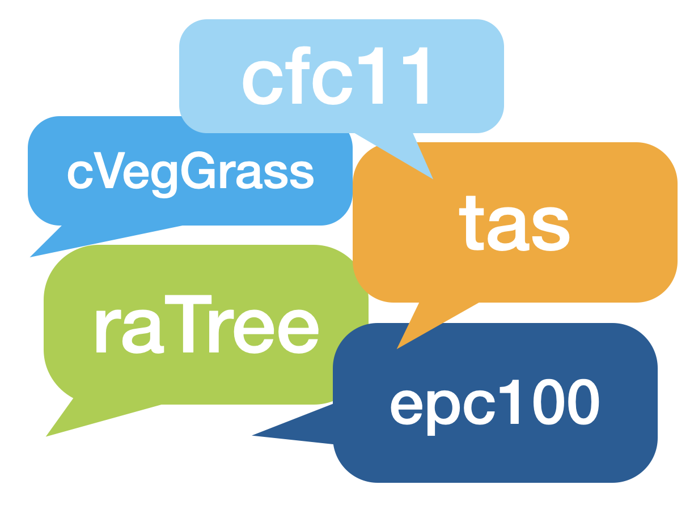

# Getting Started with Model Evaluation at NCI

Welcome to Model Evaluation and Diagnostics!

## What is MED about?

**Evaluation** involves scrutinizing the model through Model/Observation confrontations, checking its performance against real-world observations. It also includes experiment comparisons, testing the model under different scenarios, and inter-model comparisons like the Coupled Model Intercomparison Project (CMIP), assessing how the ACCESS-NRI model fares when compared with other climate models.

**Diagnostics** involves constant monitoring of model runs to detect any anomalies or inconsistencies and a thorough analysis of outputs to verify the model's accuracy over time.

## How can you get started with MED?

Here, we provide you the important information to give you access to the large data that we curate at NCI's storage and show you how you can use it to figure out how fit for purpose specific models are, in particular when you compare them to osbervational data:

    <a href="../../get_started" class="squared-card default-text-color">
        

            </img>
        

        
Computing Access

    </a>
    <a href="model_evaluation_getting_started" class="squared-card default-text-color">
        

            </img>
        

        
MED Conda Environment

    </a>
    <a href="model_variables" class="squared-card default-text-color">
        

            </img>
        

        
Model Variables

    </a>

