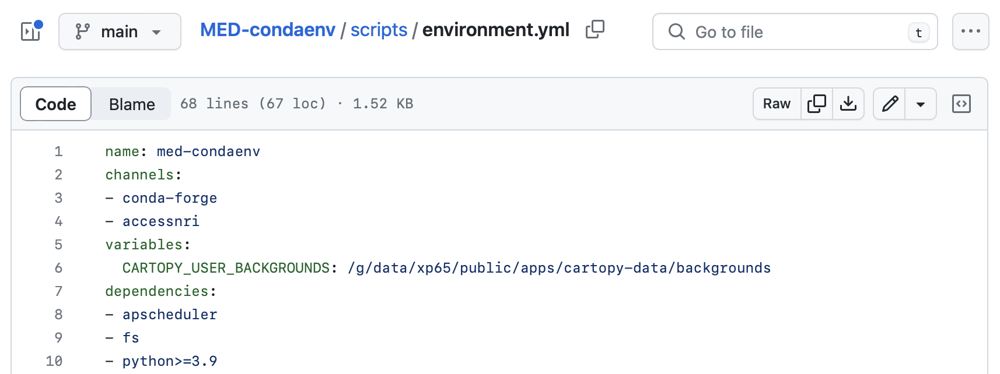

# Model Evaluation Environment at NCI's Gadi

At this stage of *Getting Started*, we assume that you already have access to NCI's Gadi. If this is not the case, please go to our instructions on how to get [access to NCI's Gadi](../../get_started/index.md).

Here we describe where you can find, load, and evalulate observational and model data on Gadi.

???+ warning "ACCESS-NRI provides code and support, but not computing resources"
    You do not automatically have access to all of Gadi's storage at `/g/data/`, but need to be part of a `$PROJECT` to see files at `/g/data/$PROJECT`. Furthermore, if you use Gadi's job submission system PBS (Portable Batch System), you need to add the relevant storage to the `#PBS -l storage=gdata/xp65+gdata/kj13` (if you want the job to have access to `xp65` and `kj13` in this example).

## 1 `access-med`: Our currated `conda` environment on Gadi

To avoid running multiple (different) versions of code on Gadi, we provide you with a `conda` environment called `access-med` that we actually curate for you (version 0.1 is from June 2023).

In order to change to this environment, please execute the following commands after loggin onto Gadi (and as part of your PBS scripts):
```
module use /g/data/xp65/public/modules
module load conda/access-med
```

If you are planning to run your code through JupyterLab on [NCI's ARE](https://are.nci.org.au), you need to use `/g/data/xp65/public/modules` as **Module directories** and `conda/are` as **Modules** when launching a JupyterLab session.

## 2 What is part of the `access-med` enrivonment?

You are now able to use the scripts of our currated environment, including `python3`, `intake`, `jupyter`, `esmvaltool`, or `ilamb`. The complete list of dependencies can be found in the `environment.yml` file of our [GitHub repository](https://github.com/ACCESS-NRI/MED-condaenv/blob/main/scripts/environment.yml):

[](https://github.com/ACCESS-NRI/MED-condaenv/issues)

<!-- ## 3 If you need more packages

Simply raise an issue to *add a package* in our [ACCESS-NRI/MED-condaenv GitHub repository](https://github.com/ACCESS-NRI/MED-condaenv/issues):

[](https://github.com/ACCESS-NRI/MED-condaenv/issues) -->