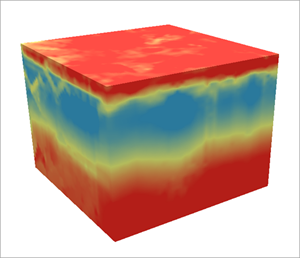
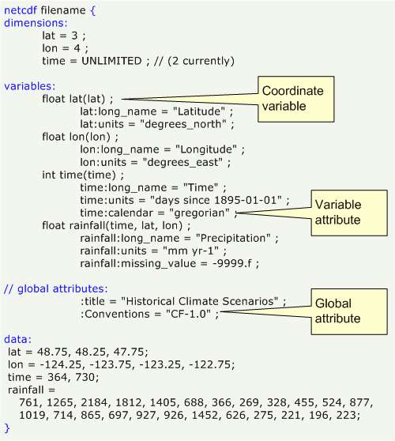

# Model Output: Formats and Variables

<!-- For this content, I have used a lot of text from this website: https://pro.arcgis.com/en/pro-app/latest/help/data/multidimensional/fundamentals-of-netcdf-data-storage.htm -->

For climate modelling, we need to store multidimensional scientific data (variables) such as temperature, humidity, pressure, wind speed, and direction.

<div style="text-align: center;">
     
 </div>

ACCESS-NRI strives for comparable model outputs for easily model evaluation.

We therefore support projects like the Coupled Model Intercomparison Projects (CMIP) and the use of common data formats and variables.

## 1 Network Common Data Format (NetCDF)

Many organizations and scientific groups in different countries have adopted a data format called [NetCDF](https://www.unidata.ucar.edu/software/NetCDF/) by the Unidata Community as a standard way to represent some forms of scientific data.

NetCDF (with file extensions `*.nc`) is a set of software libraries and self-describing, machine-independent data formats that support the creation, access, and sharing of array-oriented scientific data.

- **Self-describing** means that the `*.nc` files include not only the data itself, but also a *header* with `metadata` that describes the layout of the data.
- **Machine-independent** means that the  `*.nc` files can be accessed by computers with different ways of storing integers, characters, and floating-point numbers.
- **Array-oriented** means that the `*.nc` data is typically spanning multiple dimensions with the same lengths (like latitude and longitude or time) and variables (like temperature or humidity) which are stored in arrays.

<div style="text-align: center;">
     
 </div>

### 1.1 NetCDF metadata

Metadata enables users of data from different sources to decide which quantities are comparable, and facilitates building applications with powerful extraction, regridding, and display capabilities.

To facilitate this process, there are conventions for CF (Climate and Forecast) metadata. These are designed to promote the processing and sharing of files created with NetCDF. The conventions define metadata that provide a definitive description of what the data in each variable represents, and the spatial and temporal properties of the data. Learn more about the CF metadata conventions [here](http://cfconventions.org).

### 1.2 NetCDF data and variables

The data in a netCDF file is stored in the form of arrays. For example, temperature varying over time at a location is stored as a one-dimensional array. Temperature over an area for a given time is stored as a two-dimensional array. Three-dimensional (3D) data, like temperature over an area varying with time, or four-dimensional (4D) data, like temperature over an area varying with time and altitude, is stored as a series of two-dimensional arrays.

## 2 Common Variables

Using common variables is key for a united climate modelling community. While we are trying to bring together modellers from different communities, we understand that the variables used for climate modelling may differ for historical reasons. Here, we are collating lists of different widely used variable formats.

<!-- We have created a prototype of markdown files with variable tables that can be queried via jquery -->
<!-- Because they were not ready for quick searches (jquery with extended html tables is slow), we did not include them in the Legacy Relase (July/August 2023). -->
<!-- The code and markdown files are hosted on a github repository, however: https://github.com/svenbuder/access_model_variables -->

### 2.1 Variables of CMIP6 (Coupled Model Intercomparison Project Version 6)

You can search the extensive list of Coupled Model Intercomparison Project version 6 on [this website](Chttps://clipc-services.ceda.ac.uk/dreq/index/var.html).

### 2.2 Variables of the ERA5 atmospheric reanalysis

ERA5 is the fifth generation ECMWF atmospheric reanalysis of the global climate covering the period from January 1940 to present. ERA5 is produced by the Copernicus Climate Change Service (C3S) at ECMWF. ERA5 provides hourly estimates of a large number of atmospheric, land and oceanic climate variables.

A full list of ERA5 parameters is available on the [ECMWF database](https://codes.ecmwf.int/grib/param-db/). It covers both the [ERA5 parameter listings](https://confluence.ecmwf.int/display/CKB/ERA5%3A+data+documentation#ERA5:datadocumentation-Parameterlistings) as well as the [ERA5-LAND parameter listings](https://confluence.ecmwf.int/display/CKB/ERA5-Land%3A+data+documentation#ERA5Land:datadocumentation-parameterlistingParameterlistings).

## 3 Loading NetCDF files

Our Model Evaluation and Diagnostics tools are based around the reading and storing of files via the Python package `xarray`. You can find a quick overview [here](https://docs.xarray.dev/en/stable/getting-started-guide/quick-overview.html) and tutorials [here](
https://tutorial.xarray.dev/intro.html#).

We provide `xarray` through out `conda` environment, so you can use it either directly as shown below, or through the dataset capabilities of our catalog [ACCESS-NRI Model Intake Catalog Tool](../../model_evaluation_model_catalogs/index.md).

```
import xarray as xr
dataset = xr.open_dataset("example.nc")
dataset
```

<div style="text-align: center;">
     
 </div>
