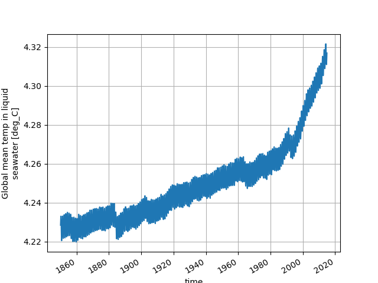

# ACCESS-NRI intake Model Catalog

The ACCESS-NRI intake catalog aims to provide a way for Python users to discover and load data across a broad range of climate data products available on the Australian NCI supercomputer Gadi. For detailed information, tutorials and more, please go to the
<div class="card-container">
    <a href="https://access-nri-intake-catalog.readthedocs.io/en/latest/index.html" class="aspect1to2-card default-text-color">
        <div class="squared-card-image-container">
            </img>
        </div>
        <div class="squared-card-text-container bold">Documentation</div>
    </a>
</div>

## What is the ACCESS-NRI intake Model Catalog?

The ACCESS-NRI catalog is essentially a table of climate data products that exist on Gadi. Each entry in the table corresponds to a different product, and the columns contain attributes associated with each product–things like the models, frequencies and variables available. Users can search on the attributes to find the products that might be useful to them. For example, a user might want to know which data products contain variables X, Y and Z at monthly frequency. The ACCESS-NRI catalog enables users to find products that satisfy their query and to subsequently load their data without having to know the location and structure of the underlying files.

## Showcase: use intake to easily find, load and plot data

In this showcase, we'll demonstrate one of the simplest use-cases of the ACCESS-NRI intake catalog: a user wants to plot a timeseries of a variable from a specific data product. Here, the variable is a scalar ocean variable called "temp_global_ave" and the product is an ACCESS-OM2 run called "025deg_jra55_iaf_omip2_cycle1".

First we load the catalog using

```python
import intake
catalog = intake.cat.access_nri
```

Now we can load and plot available datasets of the variable "temp_global_ave" from the product "025deg_jra55_iaf_omip2_cycle1" using

```python
import matplotlib.pyplot as plt

dataset_dict = catalog["025deg_jra55_iaf_omip2_cycle1"].search(
    variable="temp_global_ave"
).to_dataset_dict()

# `dataset_dict` contains two xarray Datasets, one at daily frequency and one at monthly
dataset_dict["ocean_scalar_snapshot.1day"]["temp_global_ave"].plot(label="daily")
dataset_dict["ocean_scalar.1mon"]["temp_global_ave"].plot(label="monthly")
plt.title("")
plt.legend()
plt.grid()
```

<div style="text-align: center;">
    
</div>
