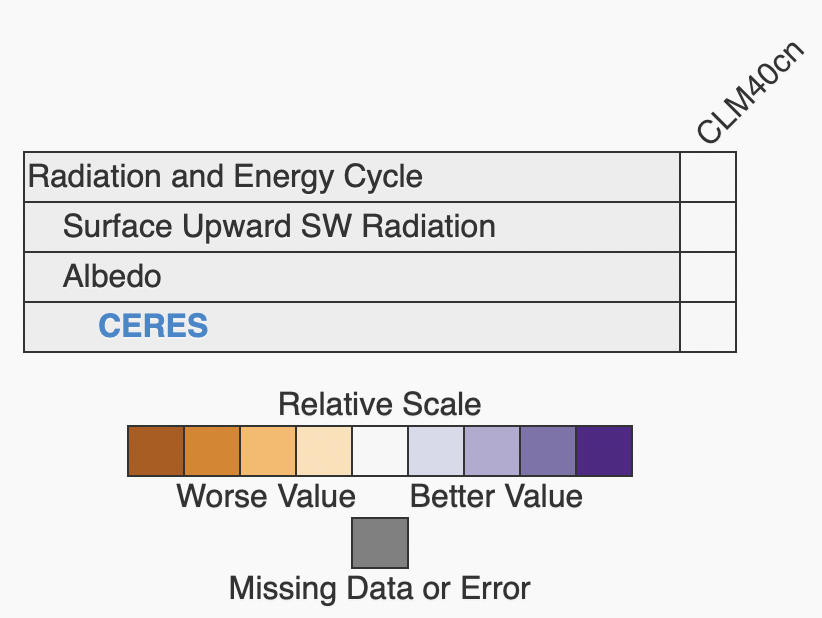
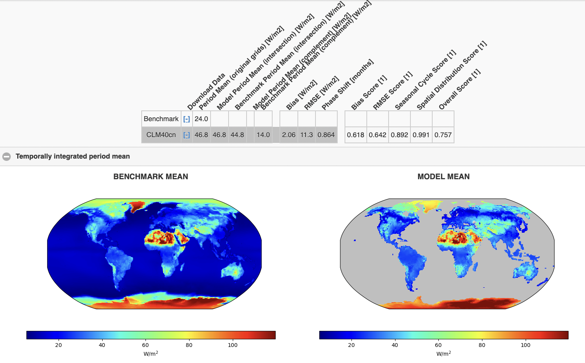

# Tutorial for using `ilamb` on Gadi@NCI

This tutorial explains how you can setup and run International Land Model Benchmarking (ILAMB) and International Ocean Model Benchmarking (IOMB) tests on `NCI` infrastracture. Both projects are maintained as `python` code under the package name `ilamb`.

The Tutorial contains:  

1. [Background](#1-background-international-land-model-benchmarking-ilamb-and-international-ocean-model-benchmarking-iomb)    
2. [Installation guide](#2-installing-ilamb)    
3. [Setup details](#3-configuring-ilamb)  
4. [Run `ilamb`](#4-run-ilamb)      
5. [Run `liamb` on `NCI`](#5-run-ilamb-on-nci)  
6. [Fix your setup with `ilamb-doctor`](#6-fix-your-interactive-setup-with-ilamb_doctor)  
                                                                                                   
## 1. Background: International Land Model Benchmarking (ILAMB) and International Ocean Model Benchmarking (IOMB)

As earth system models (ESMs) become increasingly complex, there is a growing need for comprehensive and multi-faceted evaluation of model projections. The International Land Model Benchmarking (ILAMB) project is a model-data intercomparison and integration project designed to improve the performance of land models and, in parallel, improve the design of new measurement campaigns to reduce uncertainties associated with key land surface processes.

If you have used (and installed) `ilamb` on NCI and know the basic principle of `ilamb`, you can start from [Section 5) Guide for using ilamb on NCI](#5-guide-for-use-on-nci).

## 2. Installing `ilamb`

For NCI users, ACCESS-NRI is providing a `conda` environment called `ilamb_dev` through the `xp65` project, with ilamb installed. You can load and activate it via:

```
>>> module use /g/data/xp65/public/modules
>>> module load conda/ilamb_dev
>>> conda activate ilamb_dev
```

We will soon add `ilamb` also to the ACCESS-NRI MED `conda` environment, `access-med` under project`xp65`.

If you want to install `ilamb` yourself, please follow the official installation instructions at [https://www.ilamb.org/doc/install.html](https://www.ilamb.org/doc/install.html).

## 3. Configuring `ilamb`

Before you can run `ilamb`, you need to configure a few things:

3.1. [Organise the ILAMB_ROOT path](#31-organise-the-ilamb_root-path)  
3.2. [Set up a `config` file](#32-set-up-a-config-file)  
3.3. [Set up a `modelroute` and `regions` files](#33-set-up-modelroute-and-regions-files) (Optional, if you want to run only a subset of models and/or specific regions of the world)
3.4. [Download a `shapefiles` files locally](#33-download-a-shapefiles-files-locally) (Optional online, necessary offline e.g. on NCI compute nodes)

### 3.1 Organise the ILAMB_ROOT path

`ilamb` demands files to be organised in a specific directory structure of `DATA` and `MODELS`.


  
If you do not have your own files yet, you can download and use [example files](https://www.ilamb.org/Downloads/minimal_ILAMB_data.tgz) provided as part of the  of `ilamb`'s [*First Steps* Tutorial](https://www.ilamb.org/doc/first_steps.html)

The following tree represents the organization of the contents of this extracted sample data (Note: We renamed the main directory name):
```
$ILAMB_ROOT (renamed from "ILAMB_sample")
├── sample.cfg (see [Section 3.2](#32-set-up-a-config-file))
├── modelroute.txt (optional, see [Section 3.3](#33-set-up-modelroute-and-regions-files))
├── regions.txt (optional, see [Section 3.3](#33-set-up-modelroute-and-regions-files))
├── DATA
│   ├── albedo
│   │   └── CERES
│   │       └── albedo_0.5x0.5.nc
│   └── rsus
│       └── CERES
│           └── rsus_0.5x0.5.nc
└── MODELS
    └── CLM40cn
        ├── rsds
        │   └── rsds_Amon_CLM40cn_historical_r1i1p1_185001-201012.nc
        └── rsus
            └── rsus_Amon_CLM40cn_historical_r1i1p1_185001-201012.nc
```

There are two main branches in this directory. The first is the `DATA` directory–this is where we keep the observational datasets each in a subdirectory bearing the name of the variable. While not strictly necesary to follow this form, it is a convenient convention. The second branch is the `MODEL` directory in which we see a single model result from CLM.

#### 3.1.1 Add files to DATA

There is a lot of DATA available to add. Take a look at https://www.ilamb.org/ILAMB-Data/ and https://www.ilamb.org/IOMB-Data/ for extensive lists for ILAMB-Data (land modelling) and IOMB-Data (ocean modelling).

`ilamb` has a commandline prompt to add new DATA in a substructure. To fetch all available DATA from the website, you can simply go to your $ILAMB_ROOT and type
```
>>> ilamb-fetch
```

The command will compare the above website with your current DATA and make suggestions for downloads:
```
Comparing remote location:

      https://www.ilamb.org/ILAMB-Data/

To local location:

      ./

I found the following files which are missing, out of date, or corrupt:

      .//DATA/twsa/GRACE/twsa_0.5x0.5.nc
      .//DATA/rlus/CERES/rlus_0.5x0.5.nc
      ... (we have abbreviated the extensive list here)

Download replacements? [y/n]
```

You can use `ilamb-fetch -h` to see how you can adjust the remote and local locations. If you want to download IOMB-Data, you can for example use
```
ilamb-fetch --remote_root https://www.ilamb.org/IOMB-Data/
```


#### 3.1.2 Add files to MODEL
  
If you want to add your own `MODEL` to `ilamb`, you can do so by following [this description](https://www.ilamb.org/doc/add_model.html).
  
For `NCI` users, our `ilamb_dev` `conda` enrivonment already provides all observational datasets from the `ilamb` official web and the [ACCESS-ESM1_5](https://access-hive.org.au/configurations/access-esm/) model result for user at `ILAMB_ROOT`. Stay tune for more observational and model data or tell us which ones we should definitely add.

### 3.2 Set up a `config` file

Now that we have the data, we need to setup a `config` file which the `ilamb` package will use to initiate a benchmark study.  

`ilamb` provides default config files [here](https://github.com/rubisco-sfa/ILAMB/tree/master/src/ILAMB/data).

Below we explain both which variables you can define, but start by showing you the minimum setup from the [tutorial's](https://www.ilamb.org/doc/first_steps.html). `sample.cfg` [file](https://github.com/rubisco-sfa/ILAMB/blob/master/src/ILAMB/data/sample.cfg):

#### Minimum configure file with a direct and a derived variable

```
# This configure file specifies the variables

[h1: Radiation and Energy Cycle]

[h2: Surface Upward SW Radiation]
variable = "rsus"

[CERES]
source   = "DATA/rsus/CERES/rsus_0.5x0.5.nc"

[h2: Albedo]
variable = "albedo"
derived  = "rsus/rsds"

[CERES]
source   = "DATA/albedo/CERES/albedo_0.5x0.5.nc"
```

In brief: This file allows you to create different header descriptions of the experiments (`h1`: top level for grouping of variables, `h2`: sub-level for each variable), but most importantly the `variable`s that we will look into and their `source`. In the eaxmple, `rsus` (*Surface Upward Shortwave Radiation*) and `albedo` are the used variables. The latter is actually derived from two variables by dividing the *Surface Upward Shortwave Radiation* by the *Surface Downward Shortwave Radiation*, `derived = rsus/rsds`. Finally, sources are defined as `source` with a text-font header without `h1` or `h2`.

#### Changing configure file variables

This is the list of all the variables you can modify in config file:
```
source              = None
#Full path to the observational dataset

cmap                = "jet"
#The colormap to use in rendering plots (default is 'jet')

variable            = None
#Name of the variable to extract from the source dataset

alternate_vars      = None
#Other accepted variable names when extracting from models

derived             = None
#An algebraic expression which captures how the confrontation variable may be generated

land                = False
#Enable to force the masking of areas with no land (default is False)

bgcolor             = "#EDEDED"
#Background color

table_unit          = None
#The unit to use when displaying output in tables on the HTML page

plot_unit           = None
#The unit to use when displaying output on plots on the HTML page

space_mean          = True
#Disable to compute sums of the variable over space instead of mean values

relationships       = None
#A list of confrontations with whose data we use to study relationships, the syntax is "h2 tag/observational dataset". You will see the relationship part in the output if you specify some relationship.

ctype               = None
#Choose a specific Confrontion class. 

regions             = None
#Specify the regions of confrontation

skip_rmse           = False
#akip rmse in program

skip_iav            = True
#Ship iav in program

mass_weighting      = False
#if switch to true, using an average data in a period to normalize

weight              = 1    
# if a dataset has no weight specified, it is implicitly 1

```

### 3.3 Set up `modelroute` and `regions` files

If you plan to run only a specific subset of models, you can already define them in a `modelroute.txt` file. It could look like our specific example for running different versions (1, 2, and 3) of the ACCESS-ESM 1.5 suite:

```
# Model Name                    , PATH/TO/MODELS  , EXTRA COMMANDS
ACCESS_ESM1-5-r1i1p1f1          , MODELS/r1i1p1f1 , CMIP6
ACCESS_ESM1-5-r2i1p1f1          , MODELS/r2i1p1f1 , CMIP6
ACCESS_ESM1-5-r3i1p1f1          , MODELS/r3i1p1f1 , CMIP6
... (abbreviated)
```

### 3.4 Download/link `shapefiles` files locally

You can download the `shapefiles` that are needed to run `ilamb` and `cartopy` offline here:

- For Land: https://www.naturalearthdata.com/http//www.naturalearthdata.com/download/110m/physical/ne_110m_land.zip
- For Ocean: https://www.naturalearthdata.com/http//www.naturalearthdata.com/download/110m/physical/ne_110m_ocean.zip

Finally, you need to define that path as `CARTOPY_DATA_DIR` via 
```
export CARTOPY_DATA_DIR=/absolute/path/to/shapefiles/directory
```

Note: For NCI, we already provide shapefiles in a directory as part of project `xp65`. After joining the project, you can thus easily use
```
export CARTOPY_DATA_DIR=/g/data/xp65/public/apps/cartopy-data
```

## 4. Run `ilamb`

### 4.1 ilamb-run

Now that we have the configuration file set up, you can run the study using the `ilamb-run` script. Executing the following command at the $ILAMB_ROOT directory will run `ilamb` as specified in your `sample.cfg` for all models of the `model_root` and all regions (`global`) of the world:
```
ilamb-run --config sample.cfg --model_root $ILAMB_ROOT/MODELS/ --regions global
```
If you are on some institutional resource, you may need to launch the above command using a submission script, or request an interactive node. As the script runs, it will yield output which resembles the following:
```
Searching for model results in /Users/ncf/sandbox/ILAMB_sample/MODELS/

                                          CLM40cn

Parsing config file sample.cfg...

                   SurfaceUpwardSWRadiation/CERES Initialized
                                     Albedo/CERES Initialized

Running model-confrontation pairs...

                   SurfaceUpwardSWRadiation/CERES CLM40cn              Completed  37.3 s
                                     Albedo/CERES CLM40cn              Completed  44.7 s

Finishing post-processing which requires collectives...

                   SurfaceUpwardSWRadiation/CERES CLM40cn              Completed   3.3 s
                                     Albedo/CERES CLM40cn              Completed   3.3 s

Completed in  91.8 s
```
What happened here? First, the script looks for model results in the directory you specified in the `--model_root` option. It will treat each subdirectory of the specified directory as a separate model result. Here since we only have one such directory, `CLM40cn`, it found that and set it up as a model in the system. Next it parsed the configure file we examined earlier. We see that it found the CERES data source for both variables as we specified it. If the source data was not found or some other problem was encountered, the green `Initialized` will appear as red text which explains what the problem was (most likely `MisplacedData`). If you encounter this error, make sure that `ILAMB_ROOT` is set correctly and that the data really is in the paths you specified in the configure file.

Next we ran all model-confrontation pairs. In our parlance, a confrontation is a benchmark observational dataset and its accompanying analsys. We have two confrontations specified in our configure file and one model, so we have two entries here. If the analysis completed without error, you will see a green `Completed` text appear along with the runtime. Here we see that `albedo` took a few seconds longer than `rsus`, presumably because we had the additional burden of reading in two datasets and combining them.

The next stage is the post-processing. This is done as a separate loop to exploit some parallelism. All the work in a model-confrontation pair is purely local to the pair. Yet plotting results on the same scale implies that we know the maxmimum and minimum values from all models and thus requires the communcation of this information. Here, as we are plotting only over the globe and not extra regions, the plotting occurs quickly.

### 4.2 Run specific models and regions

As mentioned in [Section 3.3](#33-set-up-modelroute-and-regions-files), you can adjust the models and regions that `ilamb` will run on. You can find more information in the `ilamb` [tutorial](https://www.ilamb.org/doc/ilamb_run.html). Calling `ilamb-run` with both specifications, would look like:
```
ilamb-run --config cmip.cfg --model_setup modelroute.txt --regions regions.txt
```
where you call a specific config file (see [Section 3.2](#32-set-up-a-config-file)) as well as specific model routes and regions with files (see [Section 3.3](#33-set-up-modelroute-and-regions-files)).

### 4.3 Viewing the benchmarking output in your browser

The whole process generates a directory of results within ILAMB_ROOT which by default is called `_build`. To view the results locally on your computer, navigate into this directory and start a local `http` server:
```
python -m http.server
```
You should see a message similar to this (or use http://0.0.0.0:8000/):
```
Serving HTTP on 0.0.0.0 port 8000 (http://0.0.0.0:8000/) ...
```
Open this link in your browser and you will see a webpage with a summary table in the center. As we have so few variables and a single model at this point, the table will very simple:

<p align="center"></p>  
  
As we add more variables and models, this summary table helps you understand relative differences in scores among models. For now, clicking on a row of the table will expand it to reveal the underlying datasets used. Clicking on CERES will take you to another page which presents detailed scores and plots.

<p align="center"></p>  

## 5. Run `ilamb` on NCI

If you followed the guides above, you should be familiar with how you can setup `ilamb`.

To run `ilamb` on NCI, you can either start an interactive setup [Section 5.1](#51-interactive-setup-on-nci) or use a non-interactive Portable Batch System (PBS) job [Section 5.2](#52-portable-batch-system-pbs-jobs-on-NCI).

In both cases, you need to again define the variable `$ILAMB_ROOT`

### 5.1 ILAMB_ROOT and DATA/MODEL on NCI

In our default setup, we will place ILAMB_ROOT and the shapefiles for cartopy directly in the home directory. First, you have to create the ILAMB_ROOT directory
```
mkdir $PWD/ILAMB_ROOT
```
You can then simply export their paths after login as:
```
export ILAMB_ROOT=$PWD/ILAMB_ROOT
export CARTOPY_DATA_DIR=/g/data/xp65/public/apps/cartopy-data
```

You can of course change the path of the directory, but will need to take this into account for the PBS job by adding a command to change into the $ILAMB_ROOT directory (see [PBS setup comments](https://github.com/svenbuder/ILAMB-workflow/edit/main/ilamb_note.md#52-portable-batch-system-pbs-jobs-on-nci)).

#### ILAMB_ROOT/DATA on NCI

An extensive colletion of DATA is provided in the `kj13` project. You need to have [joined the project on NCI](https://my.nci.org.au/mancini/project-search) to get access to this data.

To create a symbolic link to this data, use the bash command
```
ln -s /g/data/kj13/datasets/ilamb/DATA $ILAMB_ROOT/DATA
```

#### ILMAB_ROOT/MODEL on NCI

In the future, we will provide a symbolic link to a MODEL catalog for you as well.

For now, you will need to create the directory $ILAMB_ROOT/MODEL and populate it with symbolic links to specific models yourself.

In our example, we will use ACCESS-ESM1.5, which is provided on NCI as part of project `fs38`.  You need to have [joined the project on NCI](https://my.nci.org.au/mancini/project-search) to get access to this data.

To link the ACCESS-ESM1.5 suite files to your $ILAMB_ROOT/MODEL, simply execute the following bash command
```
mkdir $ILAMB_ROOT/MODELS
ln -s /g/data/fs38/publications/CMIP6/CMIP/CSIRO/ACCESS-ESM1-5/historical/r* $ILAMB_ROOT/MODELS
```

By the end of Section 5.1.1 and 5.1.2, your $ILAMB_ROOT Directory should look similar to
```
$ILAMB_ROOT
├── ...
├── DATA -> /g/data/kj13/datasets/ilamb/DATA
└── MODELS
    ├── r10i1p1f1 -> /g/data/fs38/publications/CMIP6/CMIP/CSIRO/ACCESS-ESM1-5/historical/r10i1p1f1
    ├── ... (abbreviated)
    └── r9i1p1f1 -> /g/data/fs38/publications/CMIP6/CMIP/CSIRO/ACCESS-ESM1-5/historical/r9i1p1f1
```

These different models have a lot of subdirectories, which are important to keep in mind when defining the `source` parameter in your `ilamb` `.cfg` file. Note that the `ilamb` files will end with `*.nc*. For example, one of the *rsus* files for run `r10i1p1f1` can be found (and used for `.cfg` under
```
source = /g/data/fs38/publications/CMIP6/CMIP/CSIRO/ACCESS-ESM1-5/historical/r1i1p1f1/Amon/rsus/gn/files/d20191115/rsus_Amon_ACCESS-ESM1-5_historical_r1i1p1f1_gn_185001-201412.nc
```
or shorter 
```
source = $ILAMB_ROOT/MODELS/r1i1p1f1/Amon/rsus/gn/files/d20191115/rsus_Amon_ACCESS-ESM1-5_historical_r1i1p1f1_gn_185001-201412.nc
```

### 5.2 Portable Batch System (PBS) jobs on NCI

The following default PBS file, let's call it `ilamb_test.sh` can help you to setup your own, while making sure to use the correct project (#PBS -P) to charge your computing cost to:
```
#!/bin/bash

#PBS -N default_ilamb
#PBS -P tm70
#PBS -q normalbw
#PBS -l ncpus=1
#PBS -l mem=32GB           
#PBS -l jobfs=10GB        
#PBS -l walltime=00:10:00  
#PBS -l storage=gdata/xp65+gdata/kj13+gdata/fs38
#PBS -l wd

module use /g/data/xp65/public/modules
module load conda/access-med-0.1

export ILAMB_ROOT=$PWD/ILAMB_ROOT
export CARTOPY_DATA_DIR=/g/data/xp65/public/apps/cartopy-data

ilamb-run --config cmip.cfg --model_setup $PWD/modelroute.txt --regions global
```

If you are not familiar with PBS jobs on NCI, you could find the guide [here](https://opus.nci.org.au/display/Help/4.+PBS+Jobs). In brief: this PBS script (which you can submit via the bash command `qsub ilamb_test.sh`), will submit a job to Gadi with the job name (#PBS -N) *default_ilamb* under project (#PBS -P) `tm70` with a normal queue (#PBS -q normalbw), for 1 CPU (#PBS -l ncpus=1) with 32 GB RAM (#PBS -l mem=32GB), with an walltime of 10 hours and access to 10 GB local disk space (#PBS -l jobfs=10GB) as well as data storage access to projects `xp65`, `kj13`, and `fs38` (again, note that you have to be [member of both projects on NCI](https://my.nci.org.au/mancini/project-search). Upon starting the job, it will change into to the working directory that you started the job from (#PBS -l wd) and load the access-med conda environment. Finally, it will export the $ILAMB_ROOT as well as $ARTOPY_DATA_DIR paths and start an `ilamb-run`.

In our example, we actually run the `cmip.cfg` file from the `ilamb` [config file github repository](https://github.com/rubisco-sfa/ILAMB/blob/master/src/ILAMB/data/) for files spec

Note: If your ILAMB_ROOT and CARTOPY_DATA_DIR are not in your directory from where you submitted the job from, then you need to adjust the export commands to their path
```
export ILAMB_ROOT=/absolute/path/where/ILAMB_ROOT/actually/is
export CARTOPY_DATA_DIR=/absolute/path/where/shapefiles/actually/are
```

Once the jobs are finished, you can again inspect the outcome as described in [Section 4.3](#43-viewing-the-benchmarking-output-in-your-browser)

## 6. Fix your setup with ilamb_doctor

`ilamb_doctor ` is a script you can use to diagnosing some missing model values or what is incorrect or missing from a given analysis. It takes options similar to `ilamb-run` and is used in the following way:
```[ILAMB/test]$ ilamb-doctor --config test.cfg --model_root ${ILAMB_ROOT}/MODELS/CLM

Searching for model results in /Users/ncf/ILAMB//MODELS/CLM

                                   CLM40n16r228
                                   CLM45n16r228
                                   CLM50n18r229

We will now look in each model for the variables in the ILAMB
configure file you specified (test.cfg). The color green is used to reflect
which variables were found in the model. The color red is used to
reflect that a model is missing a required variable.

                           Biomass/GlobalCarbon CLM40n16r228 biomass or cVeg
                                        ... (abbreviated)
                            Precipitation/GPCP2 CLM50n18r229 pr
```
Here we have run the command on some inputs in our test directory. You will see a list of the confrontations we run and the variables which are required or their synonyms. What is missing in this tutorial is the text coloring which will indicate if a given model has the required variables.

We have finish the introduction of basic `ilamb` usage. We believe you have some understanding of `ilamb` and cont wait to use it. if you still have any question or you want some developer level support, you can find more detail in their [official tutorial](https://www.ilamb.org/doc/tutorial.html).
