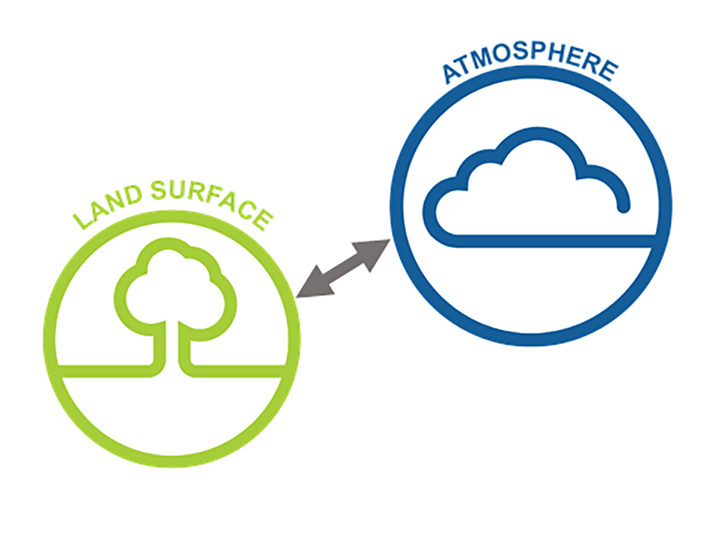
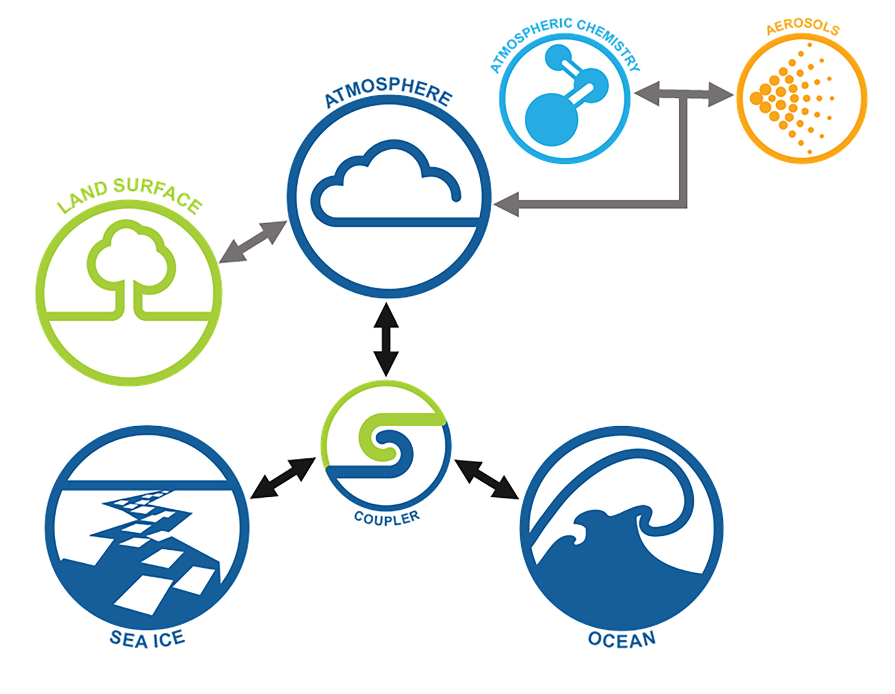
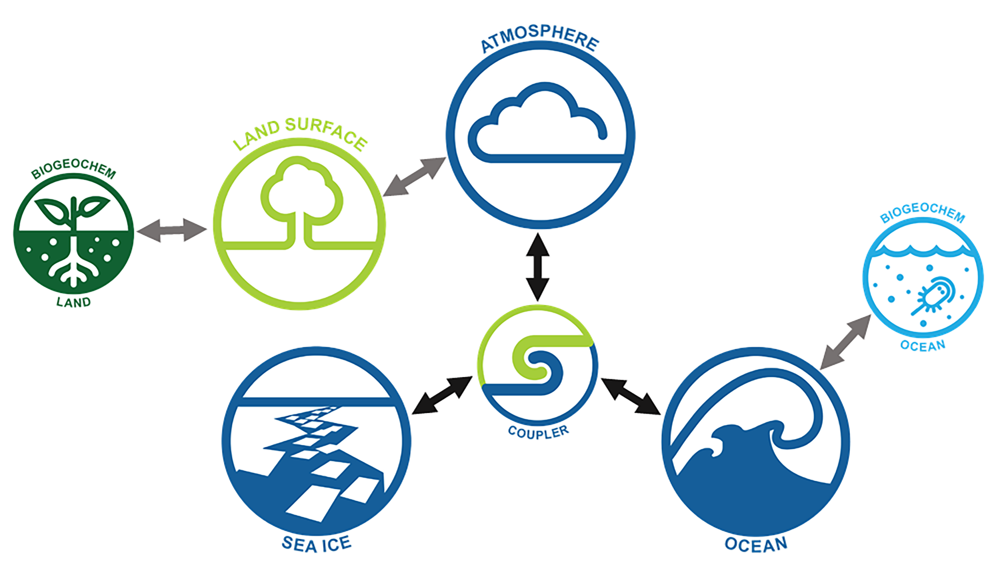
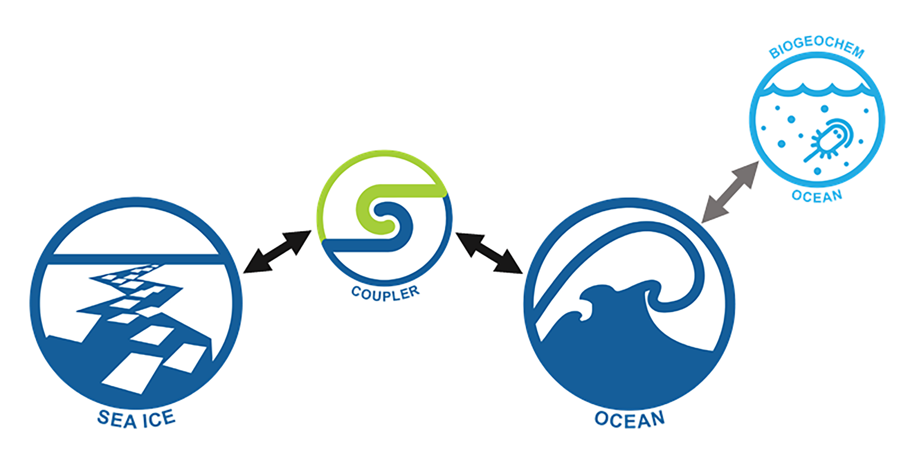

# 
Supported ACCESS Model Configurations

    <a href="access-am/" class="rectangular-card default-text-color" style="height:10em;">
            

                </img> 
            

            

                ACCESS-AM
                
                    ACCESS-AM is a global climate model that includes atmosphere and land components, driven by historical sea surface temperature and ice data.
                
            

    </a>
     <a href="access-cm/" class="rectangular-card default-text-color" style="height:10em;">
            

                </img> 
            

            

                ACCESS-CM
                
                    ACCESS-CM is a global climate model that includes the atmosphere, land, ocean and sea-ice components, and produces physical climate simulations.
                
            

    </a>
    <a href="access-esm/" class="rectangular-card default-text-color" style="height:10em;">
            

                </img> 
            

            

                ACCESS-ESM
                
                    ACCESS-ESM is a global climate model with additional land and ocean biogeochemical components to simulate both the physical climate and global biogeochemical cycles.
                
            

    </a>
    <a href="access-om/" class="rectangular-card default-text-color" style="height:10em;">
            

                </img> 
            

            

                ACCESS-OM
                
                    ACCESS-OM is a global coupled ocean and sea ice model used to understand both physical and biogeochemical processes in the ocean.
                
            

    </a>

