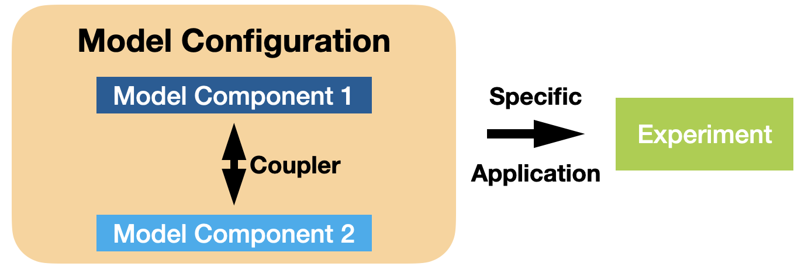

# Supported ACCESS Models

ACCESS models are computer codes comprising complex mathematical representations of major Earth system components (atmosphere, land surface, ocean and sea ice) based on physical, biological and chemical principles or laws. Different ACCESS model components can be linked together via a coupler to form ACCESS model configurations (e.g. ACCESS-ESM), which are then used to simulate realistic past or future conditions and idealised experiments.
<!-- ACCESS is a family of related computer models that are able to represent different parts of the Earth system trough the deployment of various model components. ACCESS models link these model components through software called couplers to form different Model Configurations. -->
<!-- See also specific phrasing of components / configurations / experiments -->
<!-- https://access-nri.github.io/procedures-and-practices/pr-preview/pr-19/release/release_specification/ -->

<!--  -->

## Supported ACCESS Model Configurations

<a href="configurations/access-am/" class="rectangular-card default-text-color" style="height: 10em;">
        

            </img> 
        

        

            ACCESS-AM
            
                ACCESS-AM is a global climate model that includes atmosphere and land components, driven by historical sea surface temperature and ice data.
            
        

    </a>
    <a href="configurations/access-cm/" class="rectangular-card default-text-color" style="height: 10em;">
        

            </img> 
        

        

            ACCESS-CM
            
                ACCESS-CM is a global climate model that includes the atmosphere, land, ocean and sea-ice components, and produces physical climate simulations.
            
        

    </a>
    <a href="configurations/access-esm/" class="rectangular-card default-text-color" style="height: 10em;">
        

            </img> 
        

        

            ACCESS-ESM
            
                ACCESS-ESM is a global climate model with additional land and ocean biogeochemical components to simulate both the physical climate and global biogeochemical cycles.
            
        

    </a>
    <a href="configurations/access-om/" class="rectangular-card default-text-color" style="height: 10em;">
        

            </img> 
        

        

            ACCESS-OM
            
                ACCESS-OM is a global coupled ocean and sea ice model used to understand both physical and biogeochemical processes in the ocean.
            
        

    </a>

## ACCESS Model Components

    <a href="model_components/atmosphere" class="vertical-card aspect-ratio1to1 default-text-color">
        

            </img>
        

        
Atmosphere

    </a>
    <a href="model_components/land" class="vertical-card aspect-ratio1to1 default-text-color">
        

            </img>
        

        
Land

    </a>
    <a href="model_components/ocean" class="vertical-card aspect-ratio1to1 default-text-color">
        

            </img>
        

        
Ocean

    </a>
    <a href="model_components/sea-ice" class="vertical-card aspect-ratio1to1 default-text-color">
        

            </img>
        

        
Sea Ice

    </a>
    <a href="model_components/aerosols_atmospheric_chemistry" class="vertical-card aspect-ratio1to1 default-text-color">
        

            </img>
        

        
Aerosols

    </a>
    <a href="model_components/aerosols_atmospheric_chemistry" class="vertical-card aspect-ratio1to1 default-text-color">
        

            </img>
        

        
Atmospheric Chemistry

    </a>
    <a href="model_components/bgc_land" class="vertical-card aspect-ratio1to1 default-text-color">
        

            </img>
        

        
Biogeochemistry Land

    </a>
    <a href="model_components/bgc_ocean" class="vertical-card aspect-ratio1to1 default-text-color">
        

            </img>
        

        
Biogeochemistry Ocean

    </a>
    <a href="model_components/coupler" class="vertical-card aspect-ratio1to1 default-text-color">
        

            </img>
        

        
Coupler

    </a>

