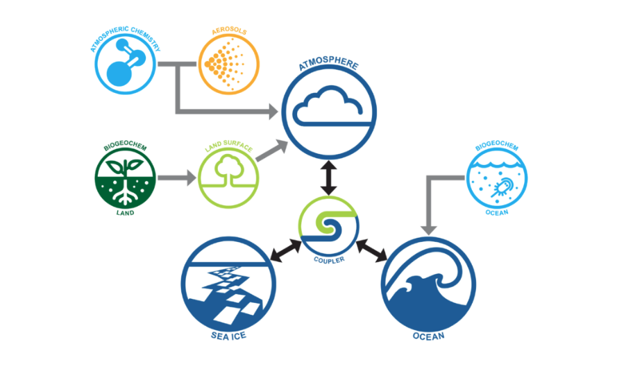

# 
 ACCESS Models 

ACCESS is a family of related computer models or components that represent
different parts of the Earth system. ACCESS links various model components through
software called **couplers** to form different Model Configurations.

## ACCESS Model Components
<table>
    <tr>
        <td>Atmosphere</td>
        <td>Land</td>
    </tr>
    <tr>
        <td>Ocean</td>
        <td>Sea Ice</td>
    </tr>
    <tr>
        <td>Aerosols and Atmospheric Chemistry</td>
        <td>Biogeochemistry Land</td>
    </tr>
    <tr>
        <td>Biogeochemistry Ocean</td>
        <td>Coupler</td>
    </tr>
</table>

