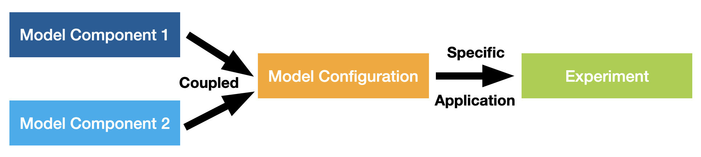
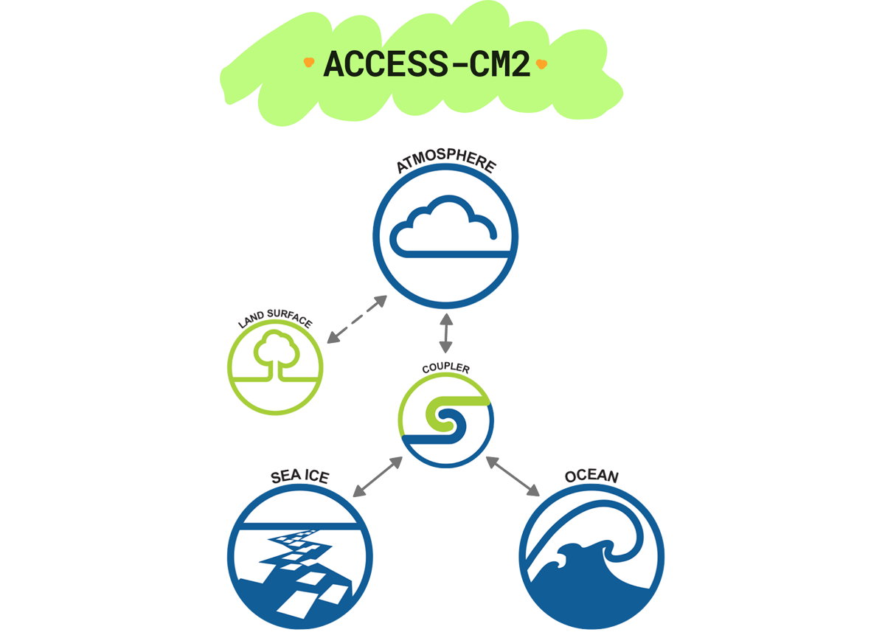
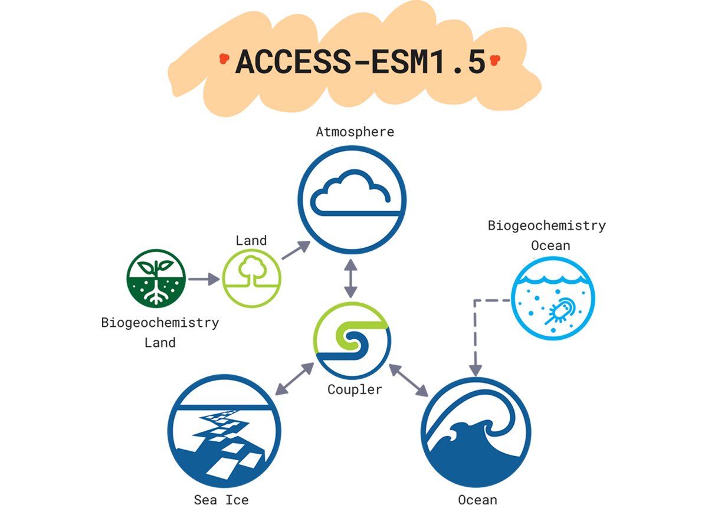
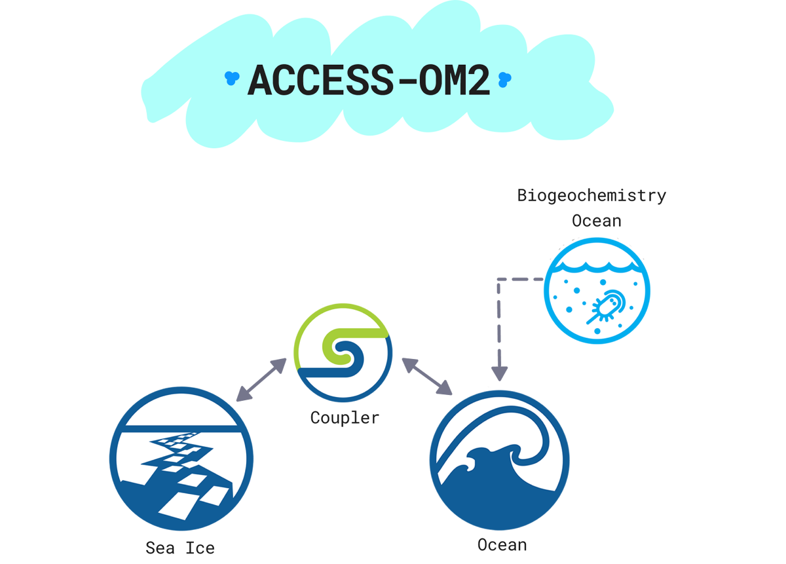

# 
Supported ACCESS Models

ACCESS models are computer codes comprising complex mathematical representations of major earth system components (atmosphere, land surface, ocean and sea ice) based on physical, biological and chemical principles or laws. Different ACCESS model components can be linked together via a coupler to form ACCESS model configurations, such as ACCESS-ESM, which are then used to perform simulations corresponding to realistic past or future conditions and idealised experiments.
<!-- ACCESS is a family of related computer models that are able to represent different parts of the Earth system trough the deployment of various model components. ACCESS models link these model components through software called couplers to form different Model Configurations. -->
<!-- See also specific phrasing of components / configurations / experiments -->
<!-- https://access-nri.github.io/procedures-and-practices/pr-preview/pr-19/release/release_specification/ -->

## Supported ACCESS Model Configurations

    <a href="configurations/access-cm/" class="justified rectangular-card default-text-color" style="height: 15em;">
        

            </img> 
        

        

            ACCESS-CM
            
                ACCESS Coupled Model (CM) produces physical climate simulations by deploying the atmosphere, ocean, and sea-ice components. ACCESS-CM features improved fluid dynamics and a microphysical aerosol scheme.
            
        

    </a>
    <a href="configurations/access-esm/" class="justified rectangular-card default-text-color" style="height: 15em;">
        

            </img> 
        

        

            ACCESS-ESM
            
                ACCESS Earth System Model (ESM) simulates the carbon and other bio-chemical cycles within the climate system, by deploying the atmosphere, ocean, and sea-ice components. ACCESS-ESM is one of the two ACCESS global coupled model versions.
            
        

    </a>
    <a href="configurations/access-om/" class="justified rectangular-card default-text-color" style="height: 15em;">
        

            </img> 
        

        

            ACCESS-OM
            
                ACCESS Ocean Model (OM) deploys the ocean and sea-ice components to provide the Australian climate community with ocean weather and climate data, including seasonal forecasting, climate variability, downscaling of climate in the marine environment around Australia, and ocean biogeochemistry.
            
        

    </a>

## ACCESS Model Components

    <a href="model_components/atmosphere" class="squared-card default-text-color">
        

            </img>
        

        
Atmosphere

    </a>
    <a href="model_components/land" class="squared-card default-text-color">
        

            </img>
        

        
Land

    </a>
    <a href="model_components/ocean" class="squared-card default-text-color">
        

            </img>
        

        
Ocean

    </a>
    <a href="model_components/sea-ice" class="squared-card default-text-color">
        

            </img>
        

        
Sea Ice

    </a>
    <a href="model_components/aerosols_atmospheric_chemistry" class="squared-card default-text-color">
        

            </img>
        

        
Aerosols

    </a>
    <a href="model_components/aerosols_atmospheric_chemistry" class="squared-card default-text-color">
        

            </img>
        

        
Atmospheric Chemistry

    </a>
    <a href="model_components/bgc_land" class="squared-card default-text-color">
        

            </img>
        

        
Biogeochemistry Land

    </a>
    <a href="model_components/bgc_ocean" class="squared-card default-text-color">
        

            </img>
        

        
Biogeochemistry Ocean

    </a>
    <a href="model_components/coupler" class="squared-card default-text-color">
        

            </img>
        

        
Coupler

    </a>

    </img>

