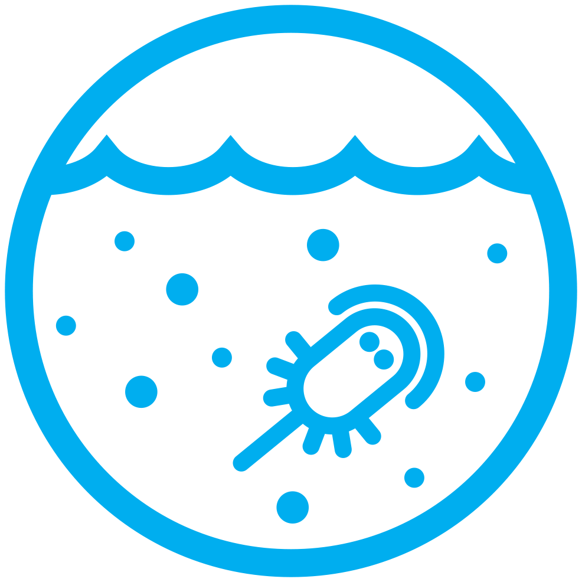

# 
 Biogeochemistry Ocean 

<!--  -->

<!-- {align=right width=40%} -->

</img>

## 
 WOMBAT  

The World Ocean Model of Biogeochemistry And Trophic-dynamics (WOMBAT) is the ocean biogeochemistry module added to ACCESS models. The core of WOMBAT is a Nutrient, Phytoplankton, Zooplankton and Detritus (NPZD) cycle. WOMBAT simulates the evolution of open-ocean phosphate, oxygen, dissolved inorganic carbon, alkalinity, iron and carbon fluxes with one zooplankton and one phytoplankton class.

### How is WOMBAT used?
WOMBAT is applied as a tracer package in the ACCESS ocean model [MOM5][mom5-github]. In the ACCESS-OM2 configuration, WOMBAT is used in MOM5 and coupled with sea ice biogeochemistry. WOMBAT is also applied in [MOM5 of the ACCESS-ESM1.5 configuration][MOM5-esm-code]  used for CMIP6.

[mom5-github]: https://github.com/mom-ocean/MOM5
[MOM5-esm-code]: https://github.com/COSIMA/ACCESS-ESM1.5-MOM5
