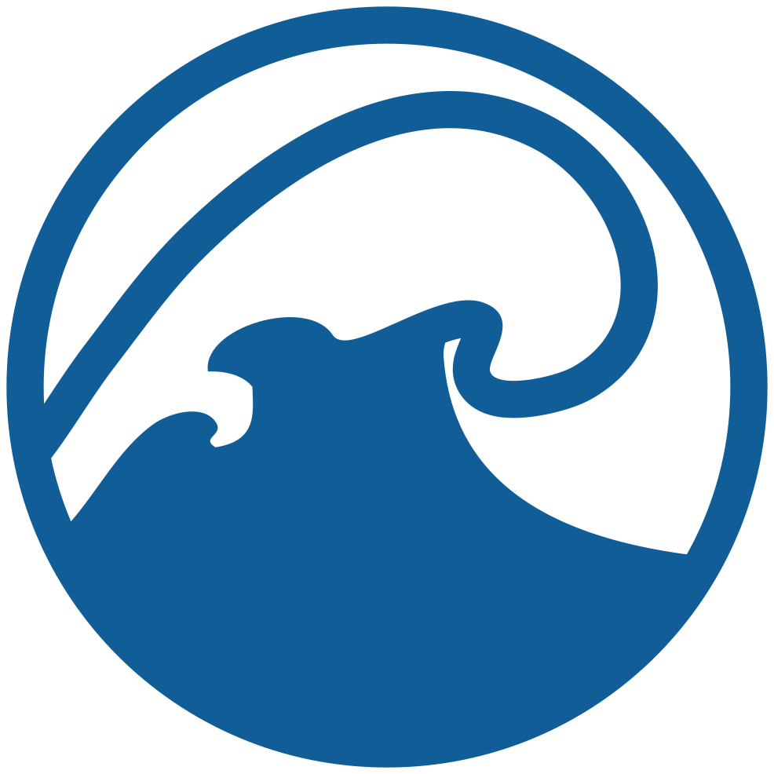

# 
 Ocean Model Component 

<!--  -->

<!-- {align=right width=40%} -->

</img>

## 
 [Modular Ocean Model (MOM)][mom-wiki]   

The [Modular Ocean Model (MOM)][mom-wiki] is one of the ocean components of the ACCESS climate model system. Used to simulate ocean currents at both regional and global scales, MOM is an invaluable tool for studying the global ocean climate system, as well as capabilities for regional and coastal applications. 

MOM is an open source development by a consortium of scientists across several government agencies and academic institutions worldwide. 

### 
 MOM5  

[**Source Code**][mom5-github]

MOM5 is used in supported configurations, such as ACCESS-OM2, ACCESS-CM2 and ACCESS-ESM1.5.

### 
 MOM6  

[**Source Code**][mom6-github] |
[**Tutorials**][mom6-tutes]

[MOM6][gfdl-web] is the most recent version. An ACCESS-OM3 configuration is currently under development that uses MOM6 as the ocean model component.

[mom5-github]: https://github.com/mom-ocean/MOM5
[mom6-github]: https://github.com/mom-ocean/MOM6
[mom6-tutes]: https://github.com/NOAA-GFDL/MOM6-examples/wiki/Tutorials
[mom-wiki]: https://mom-ocean.github.io/
[gfdl-web]: https://www.gfdl.noaa.gov/mom-ocean-model/
